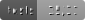

# Install

## Setup: Local Development, bare metal

For local development, on bare metal, ```tox```, ```bash``` and ```ffmpeg``` are required.
For MacOS ```brew``` is also required.

TODO: See [install_ffmpeg.py](scripts/install_ffmpeg.py)

1. Create a python virtual environment, activate and install tox:

```bash
python -m venv venv
source venv/bin/activate
pip install tox
```

2. Install ```fmpeg``` and other OS dependencies. See ```tox.ini``` for details.

```bash
tox -e install-os-dependencies
```

3. Configure

Copy ```.env.sample``` to ```.env``` and configure:

TODO: Add config documentation.

4. Set a temporary ```admin``` password:

NOTE: This command will store the password in your shell's history. Use a temporary password. You will be prompted to 
reset the password upon first login, via the User Interface.

```bash
tox -e reset-admin-password -- --password default_password
```

5. Refresh the vector database:

```bash
tox -e reindex-chromadb
```

6. Start server:

```bash
tox -e run-dev
```

7. Login:

http://localhost:10000/

TODO: Document configured port at step 2.


