# AunooAI — AI Design Patterns

**Scope:** the monolith (`tenants/*.aunoo.ai`, FastAPI + PostgreSQL/pgvector) and the SaaS backend (`saas.aunoo.ai`).
**Purpose:** a reusable catalog of the AI/LLM design patterns we apply across the platform, written so each pattern can be (a) referenced from docs and (b) lifted into a feature spec as a named building block.

Each pattern states: the **problem** it solves, the **mechanism** (with diagram where it helps), **key parameters/thresholds**, **where it's implemented** (file:line, correct as of 2026-07-18), and **spec-reuse notes** (what to copy, what to avoid).

---

## Contents

- [Part 0 — System overview](#part-0--system-overview)
- [Part 1 — Collection & Ingest](#part-1--collection--ingest)
  - 1.1 Pluggable Collector (Strategy + Factory)
  - 1.2 Multi-Provider Fan-out with Priority Dedup
  - 1.3 Recall-First Query Widening ("precision comes from scoring, not the query")
  - 1.4 Cost-Ordered Ingest Pipeline (cheap gate first)
- [Part 2 — Tiered Relevance & Enrichment](#part-2--tiered-relevance--enrichment)
  - 2.1 Tiered Relevance Cascade with Confidence Gate
  - 2.2 Context-Aware LLM Judge Prompt (brand vs theme)
  - 2.3 Persisted Alignment Score as Universal Downstream Filter
  - 2.4 Sample-Count Bootstrap Routing (LLM teaches the local model)
  - 2.5 Confidence-Gated Field Merge (SLM + LLM hybrid enrichment)
  - 2.6 Retrain → Hot-Swap → Rollback Loop
  - 2.7 Ontology-Constrained Output Validation
  - 2.8 Labeled-Field Extraction (line format, not JSON)
  - 2.9 Confidence Telemetry & Cost-Savings Accounting
- [Part 3 — Semantic Retrieval](#part-3--semantic-retrieval)
  - 3.1 pgvector ANN Store with Metadata Pre-Filter
  - 3.2 Overfetch + Cross-Encoder Rerank
  - 3.3 Query Routing & LLM Query Expansion
  - 3.4 Cross-Topic Proportional Fan-out
  - 3.5 Distance-vs-Similarity Convention (standing gotcha)
- [Part 4 — Auspex & Deep Research Agents](#part-4--auspex--deep-research-agents)
  - 4.1 Single-Pass Tool-Augmented Chat
  - 4.2 Six-Phase Deep Research Pipeline
  - 4.3 Corpus Exploration Before Planning
  - 4.4 Context Budgeting: Cluster → Diversify → Compress → Fill
  - 4.5 Pluggable Sampling Framework
  - 4.6 LLM Relevance Gate (batch judge before synthesis)
  - 4.7 Batched Map-Reduce Synthesis with Index-Anchored Citations
  - 4.8 Layered Hallucination Defenses
  - 4.9 Coverage-Gap Refinement Loop
- [Part 5 — Observer Agents & Screening](#part-5--observer-agents--screening)
  - 5.1 Natural-Language Signals Evaluated by LLM over Batches
  - 5.2 Hallucinated-URI Defense (candidate-set gate)
  - 5.3 Alert Ledgers: Upsert Dedup + Content-Identity Keys
  - 5.4 Five-Signals Composite Screening (independently degradable)
  - 5.5 Staged Review Queue (agent proposes, analyst applies)
  - 5.6 Stance Supervisor (brand-as-actor vs brand-as-target)
  - 5.7 Damped Risk Scoring with Baseline Honesty
- [Part 6 — SaaS Generation Patterns](#part-6--saas-generation-patterns)
  - 6.1 Use-Case Model Routing with Quality Gates
  - 6.2 Output Contract (never cache invalid content as success)
  - 6.3 Stale-Fallback Cache + Global Pregeneration + Gap-Fill
  - 6.4 Timeline Mementos / Worldstate Grounding
  - 6.5 Editorial Pipeline (curator + fact preflight + editor review)
  - 6.6 Style Guard / AI-Tells Self-Policing
  - 6.7 Async Job Queue Wrapping Long LLM Work
  - 6.8 Deterministic Detection → LLM Review → Recommendation Queue
- [Part 7 — Cross-Cutting LLM Infrastructure](#part-7--cross-cutting-llm-infrastructure)
  - 7.1 Alias-Based Model Routing (litellm yaml)
  - 7.2 Severity-Classified Errors, Retry & Circuit Breaker
  - 7.3 Per-Call Usage Ledger via Callbacks
  - 7.4 Reasoning-Model Call Hygiene
  - 7.5 Global Concurrency Gate
  - 7.6 Robust JSON-from-LLM Extraction
- [Appendix A — Threshold & parameter reference](#appendix-a--threshold--parameter-reference)
- [Appendix B — Model inventory](#appendix-b--model-inventory)

---

# Part 0 — System overview

The platform is one long inference funnel: cheap, high-volume models act as filters at the wide end; expensive models only ever see what survived. Nearly every pattern in this catalog is a variation on that theme, plus defenses against the two chronic LLM failure modes (hallucinated references and malformed output).

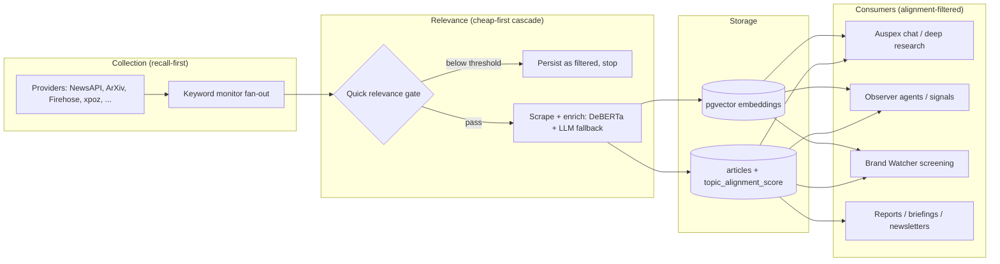

Recurring platform-wide principles (each detailed in its pattern below):

1. **Cheapest model that resolves the case** — free local models first, LLM only for the residual uncertain band (2.1, 2.5); cheap models for filtering/planning, flagship only for synthesis (4.7, 6.1).
2. **Recall at collection, precision at scoring** — search queries are deliberately widened; the persisted `topic_alignment_score` is the universal downstream filter (1.3, 2.3).
3. **LLMs may only cite what they were given** — every reference is validated against the candidate set that was in the prompt (4.8, 5.2).
4. **Dedup is content identity, never time buckets** — ledgers keyed on URI sets / content hashes make alerts and recommendations idempotent (5.3, 6.8).
5. **Agents propose, humans apply** — machine output lands in staging tables; only human action writes to authoritative stores (5.5, 6.8).
6. **Never persist invalid generated output as success** — validate, retry once, then fail loudly and serve stale (6.2, 6.5).
7. **Ground generation in current worldstate** — token-budgeted timeline/memento context blocks injected into prompts to defeat stale training knowledge (6.4).

---

# Part 1 — Collection & Ingest

## 1.1 Pluggable Collector (Strategy + Factory)

**Problem.** Many heterogeneous article/social providers (news APIs, arXiv, RSS, social firehoses) must be swappable and searched uniformly, without the ingest pipeline knowing provider internals.

**Mechanism.** An abstract `ArticleCollector` defines `search_articles(query, topic, max_results, start_date, end_date)` and `fetch_article_content(url)`, and pins a standardized output dict (`title, summary, authors, published_date, url, source, topic, raw_data`). A `CollectorFactory` registry maps source name → class, and `get_available_sources()` gates each provider on the presence of its credentials so unconfigured providers never appear in the UI.

**Where.**
- ABC: `app/collectors/base_collector.py:5`
- Factory + registry: `app/collectors/collector_factory.py:18`, credential gating at `:62`
- Implementations: `arxiv`, `newsapi`, `thenewsapi`, `bluesky`, `newsdata`, `semantic_scholar`, `rss`, `newsfirehose`, `opoint`, `reddit`, `xpoz`

**Spec-reuse notes.**
- Adding a source = implement the ABC, register in the factory, add the credential check. See `reference_collector_wiring` for the full end-to-end touchpoints.
- **Gotcha:** two registries exist — the factory (collect page / on-demand) does *not* include `xpoz`; the keyword monitor's own `_create_collector()` (`app/tasks/keyword_monitor.py:140`) does. New sources must be added to both or they'll be reachable from only one path.

## 1.2 Multi-Provider Fan-out with Priority Dedup

**Problem.** One keyword should be searched across all active providers concurrently, with duplicate URLs collapsed to the richest copy, and one slow/broken provider must not stall the rest.

**Mechanism.**

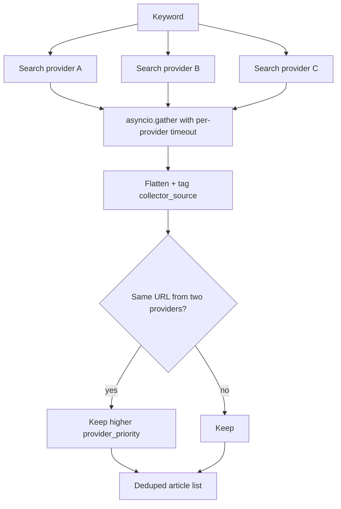

- Per-keyword, one `_search_with_collector()` task per active collector, gathered with `return_exceptions=True` and per-call `asyncio.wait_for(SEARCH_TIMEOUT_SECONDS)`.
- Exact-URL dedup with a hard-coded priority map: `newsapi:5 > thenewsapi:4 > newsdata:3 > semantic_scholar/bluesky:2 > arxiv:1`; unlisted providers tie at 0.
- Per-group scheduling: a 60 s poller pulls due groups; each group merges its own settings (providers, cadence, window, relevance threshold, social platforms) over global defaults, and temporarily swaps the collector set for its run.
- Windowing is whole-window per run (`start = now − search_date_range days`, default 7), deliberately **not** incremental since `last_checked` — repeat suppression happens downstream, not at fetch.

**Where.** `app/tasks/keyword_monitor.py` — fan-out `:441-453`, timeout wrapper `:300`, dedup `:237`, priority map `:243`, scheduler loop `:1199`, per-group settings merge `:1015`, per-group collectors `:967`.

**Spec-reuse notes.**
- Social-only groups short-circuit into a cheap single-model eval path (`SocialEvalService`, see 5.6) instead of the full news pipeline (`keyword_monitor.py:1083`).
- **Gotcha:** `provider_priority` omits `newsfirehose`, `opoint`, `xpoz`, `reddit` — they lose every collision even when their copy is richer (firehose ships full content). Extend the map when adding providers.
- Dedup is exact-URL only; querystring variants survive. Story-level dedup is a separate pattern (5.3 story clustering).

## 1.3 Recall-First Query Widening

**Problem.** Provider search backends differ wildly in query syntax; strict boolean queries silently return nothing on weaker backends (e.g. Postgres `plainto_tsquery` on the firehose). Losing recall at collection is unrecoverable — losing precision is not, because scoring filters later.

**Mechanism.** The firehose collector's `_normalize_query()` deliberately downgrades precision to recall: strips quotes and parentheses, rewrites `AND`/`+`/`|` to `OR`, and drops `NOT` terms entirely. The design philosophy is stated in the code: *"Precision comes from the relevance scoring downstream, not the search query."* Date filtering is done client-side (30-day cutoff) because the provider's server-side filter is broken.

**Where.** `app/collectors/newsfirehose_collector.py:39` (`_normalize_query`), `:235` (client-side window).

**Spec-reuse notes.**
- This is a deliberate architectural bet, not sloppiness: it only works because every consumer filters on `topic_alignment_score` (2.3). A spec that adds a new consumer of raw collected articles **must** add an alignment filter, or firehose noise reaches users.
- **Gotcha:** `military AND coup NOT football` becomes `military OR coup`. Analysts writing keywords should be told AND/NOT semantics do not survive on firehose. (Related: `/check-now` ignores per-group providers — see memory `project_asml_topic_keyword_gotchas`.)

## 1.4 Cost-Ordered Ingest Pipeline

**Problem.** Enrichment (scraping, LLM analysis, vector indexing) is expensive; most collected articles are noise (widened further by 1.3). Spend must be gated on the cheapest possible check first, and every gate must run before the next-most-expensive step.

**Mechanism.**

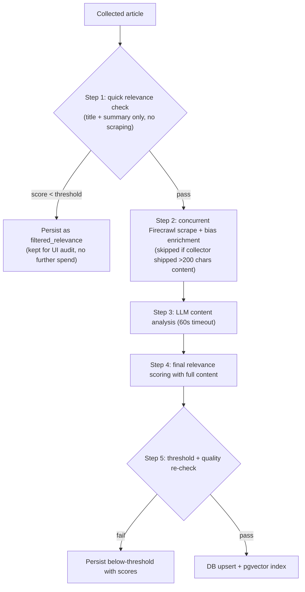

- Batch processing at `MAX_CONCURRENT = 5` with a 300 s per-batch timeout.
- The relevance threshold resolves: per-group override → global DB setting → default 0.0 (i.e. by default nothing is filtered unless a group opts in).
- An `inference_mode` setting (`local` / `hybrid` / `external`) flows into the relevance cascade (2.1) as force-flags.
- Below-threshold and error articles are **persisted with their scores**, not discarded — the UI can show why something was filtered.

**Where.** `app/services/automated_ingest_service.py` — orchestrator `:1265`, per-article gate `:821` (quick check `:847`), threshold resolution `:1440`, inference mode `:94`. Entry from the keyword monitor at `app/tasks/keyword_monitor.py:876`.

**Spec-reuse notes.**
- The ordering rule generalizes: **sort pipeline steps by cost, and re-check the cheapest rejection gate after each enrichment step.** Any new per-article pipeline should follow it.
- **Gotcha:** a second, older `app/services/auto_ingest_service.py` (different filename) coexists; the live one is `automated_ingest_service.py`. Don't extend the wrong file.

---

# Part 2 — Tiered Relevance & Enrichment

## 2.1 Tiered Relevance Cascade with Confidence Gate

**Problem.** LLM relevance judgments are accurate but cost real money at 50k+ calls/day. Free local models should decide the confident majority; the LLM should only adjudicate the genuinely uncertain band.

**Mechanism.** `HybridRelevanceService.score_relevance()` runs a cascade where each tier can *resolve* the case and stop escalation:

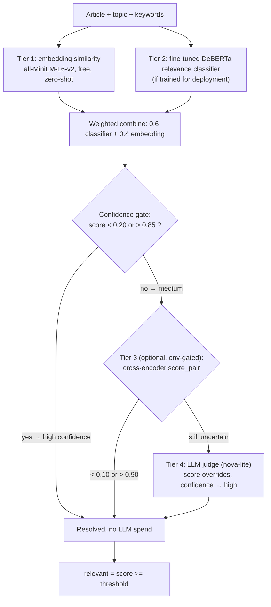

**Key parameters.**
| Parameter | Value | Notes |
|---|---|---|
| Embedding model | `all-MiniLM-L6-v2` (384-d, CPU) | topic embedding enriched with description + ≤10 keywords, cached |
| Classifier | DeBERTa, `models/relevance_classifier/final`, input `topic [SEP] title. summary`, max_len 256 | |
| Combine weights | 0.6 classifier / 0.4 embedding | |
| Confidence band | high if score < 0.20 or > 0.85 | widened from 0.35/0.65 — see gotcha |
| CE tier | env `RELEVANCE_USE_CE_TIER` (default off); resolve at < 0.10 / > 0.90 | reuses the retrieval reranker singleton |
| LLM model | env `HYBRID_RELEVANCE_LLM_MODEL`, default `nova-lite` (13× cheaper than Haiku) | highest-volume LLM path in the system |

**Where.** `app/services/hybrid_relevance_service.py` — cascade `:436`, embedding `:194`, classifier `:233`, gate `:537`, CE tier `:270`, LLM `:290`.

**Spec-reuse notes.**
- **The load-bearing subtlety:** the uncertain band must be calibrated against the *actual score distribution*. The DeBERTa classifier is bimodal (~0.04 / ~0.94), so combined scores landed at ~0.24/~0.82 — always *outside* the old 0.35–0.65 band, making the LLM fallback dead code until the band was widened to 0.20/0.85 (comment at `:531`). When specifying any confidence gate, require a distribution check, not just a threshold choice.
- The cascade shape (free → cheap → paid, each tier able to short-circuit) is the template for any high-volume classification task.
- `LLM_FALLBACK_THRESHOLD = 0.3` at `:47` is a dead legacy constant; the confidence band is the real gate.

## 2.2 Context-Aware LLM Judge Prompt

**Problem.** A generic "is this article relevant to topic X?" prompt fails in two symmetric ways: internal monitor labels (`"Brand Monitoring Wiley"`) are not literal article subjects, so real brand coverage under-scores; and theme topics get flooded by locally-true-but-immaterial items.

**Mechanism.** The LLM judge prompt is *reshaped by topic type*:
- A regex on the topic name (`^Brand Monitoring\s+(.+)$`) extracts the watched entity and injects a **brand rule**: an article primarily about the company — or its products, named competitors, or sector — scores ≥ 0.7; coincidental name collisions score 0.0–0.2.
- Theme topics instead get a **materiality rule**: purely local / single-institution items are demoted to 0.1–0.3. Brand topics deliberately skip this (company-specific items *are* the signal).
- The topic's configured keywords are threaded into the prompt ("Key entities / search terms: …") so the judge sees what the analyst actually means by the topic — this fixed a bug where the LLM judged against the literal topic label only.
- Output contract is a single bare number 0.0–1.0, parsed with a lenient number regex because Bedrock models prefix prose.

**Where.** `app/services/hybrid_relevance_service.py:290-360` (`_compute_llm_score`); keyword threading from `app/services/automated_ingest_service.py:420`.

**Spec-reuse notes.** Whenever an LLM judges against an internal label, the spec must state what extra context (entity extraction, keyword list, materiality rules) is injected — a bare label is never enough. See memory `project_relevance_scorer_brand_bug` for the incident that produced this pattern.

## 2.3 Persisted Alignment Score as Universal Downstream Filter

**Problem.** With recall-first collection (1.3), stored articles include noise. Every customer-facing surface needs one consistent way to see only on-topic material.

**Mechanism.** Ingest persists the cascade score to `articles.topic_alignment_score` (plus `relevance_score`, `keyword_relevance_score`, per-model audit fields). The canonical read is `get_relevant_articles_for_topic()`: `topic = ? AND analyzed = TRUE AND topic_alignment_score > min_alignment`, ordered by alignment. Real on-topic articles score 0.9–1.0, feed noise scores ~0.0, so a modest floor separates cleanly.

**Where.** Score mapping `app/services/automated_ingest_service.py:465-508`; canonical filter `app/database_query_facade.py:1129` (default floor 0.3). Brand Watcher paths use 0.4, often `COALESCE(bac.relevance_score, a.topic_alignment_score) >= 0.4` (e.g. `brand_watcher_routes.py:2803`); topic reports use 0.7 for "strongly on-topic" (`topic_report_service.py:503`).

**Spec-reuse notes.**
- **Rule for specs:** any customer-facing article selection MUST filter on `topic_alignment_score` (prefer `get_relevant_articles_for_topic`). This is standing policy (memory `wiley_topic_collection_noise`).
- **Gotcha:** floors are inconsistent and hard-coded per consumer (0.3 / 0.4 / 0.7) with no central config. A spec touching several consumers should state which floor applies where.

## 2.4 Sample-Count Bootstrap Routing

**Problem.** A freshly-added topic has no trained local-model coverage, but needs quality enrichment immediately — and needs to accumulate training data so the free local model can eventually take over.

**Mechanism.** Per topic × field, route by accumulated training-sample count:

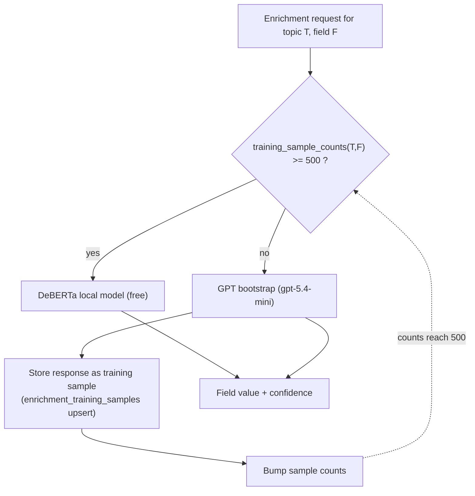

- `DEBERTA_THRESHOLD = 500` samples per field; counts cached 60 s.
- Every GPT bootstrap call double-writes: the answer *and* a training sample (`ON CONFLICT (article_uri, field_name) DO UPDATE`). Bootstrapping 500 samples for a topic costs ~$0.75.
- A routing-status API exposes per-field `ready | bootstrapping` with progress %, powering the training dashboard.
- Readiness tiers for the retrain trigger: `min_per_class = 50`, `finetune_min = 500`.

**Where.** `app/services/hybrid_enrichment_service.py:54` (threshold), `:119-236` (routing); `app/services/training_bootstrap_service.py:109` (bootstrap + store), `:36-42` (thresholds).

**Spec-reuse notes.** This is the general "expensive teacher trains cheap student in production" pattern — the same shape used for the relevance classifier retrain (memory `project_relevance_retrain_ledger`). Specs introducing a new classification field should define: the label ontology, the bootstrap model, the sample threshold, and where the routing status is surfaced.

## 2.5 Confidence-Gated Field Merge

**Problem.** Even a trained local model has shaky individual predictions (the 15-way `future_signal` head sits at ~0.51 accuracy). Per-prediction, don't trust a weak softmax; per-article, the LLM has to run anyway for generative fields (summary, explanations).

**Mechanism.** One DeBERTa forward pass predicts all four classification fields (sentiment, time_to_impact, driver_type, future_signal) with softmax-max as confidence. Fields with confidence ≥ 0.6 are accepted from the SLM; the rest are left for the LLM analyzer (2.8) to fill alongside summary/explanations. A per-field `enrichment_sources` map records which model won (`deberta` / `gpt`), and `_enrichment_method` is stamped `hybrid_slm(fields...)` for audit.

**Where.** Gate: `app/services/automated_ingest_service.py:289-320` (threshold hard-coded at `:298`). Model: `app/services/enrichment_service.py` (singleton, lazy-load, HF-hub fallback); multi-task head defined in `scripts/train_enrichment_model.py:129-213`. Label counts must match `models/enrichment_model/final/model_config.json` — sentiment:4, time_to_impact:6, driver_type:5, future_signal:15.

**Spec-reuse notes.**
- Confidence is **raw softmax, uncalibrated** — the 0.6 cut is validated observationally via the confidence telemetry (2.9), not by calibration. A spec relying on this gate for a new field should require a 24 h telemetry review after launch.
- **Gotcha:** the 0.6 appears twice, independently — the live gate (`automated_ingest_service.py:298`) and the stats SQL (`training_routes.py:197`). Changing one does not change the other.

## 2.6 Retrain → Hot-Swap → Rollback Loop

**Problem.** Close the loop so the local model improves as GPT bootstraps new topics — with zero-downtime deployment and a safe rollback.

**Mechanism.**

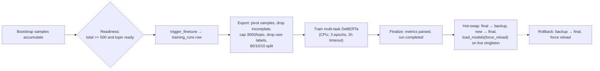

**Where.** `app/services/finetuning_service.py` — readiness `:82`, trigger `:123`, export subprocess `:258`, train subprocess `:283`, hot-swap `:509`, rollback `:574`. API: `app/routes/training_routes.py` (`/trigger-finetune`, `/runs/{id}/deploy`, `/rollback`).

**Spec-reuse notes.**
- Hot-swap works because model access goes through a singleton with `force_reload` — any new local model should follow the same loader shape.
- **Gotchas:** training runs in a bare daemon thread (a process restart orphans `status=running` with no recovery — a spec productionizing this needs a task queue). Label mappings are **data-driven at export time** (rare labels dropped, near-duplicate labels survive), which is why `future_signal` has messy labels; curate the ontology upstream, not in the exporter. The trainer's default output dir is the LIVE model dir (memory `project_relevance_retrain_ledger`).

## 2.7 Ontology-Constrained Output Validation

**Problem.** LLMs put out-of-vocabulary garbage in classification fields (a sentiment value in `future_signal`, invented categories, `"N/A"`), which poisons every downstream aggregation.

**Mechanism.** Immediately after parsing, every classification field is validated against the same option lists that were injected into the prompt. Out-of-vocabulary values are coerced: `future_signal`/`category` → `"Other"` (original bad value preserved into the explanation field); `sentiment`/`time_to_impact`/`driver_type` → `""`. The analysis cache key includes a hash of the ontology (`{uri}_{model}_{categories_hash}`) so the same article analyzed under different topic ontologies never cross-pollutes.

**Where.** `app/analyzers/article_analyzer.py:326-380` (`_validate_analysis_fields`); cache key `:132-134`.

**Spec-reuse notes.** The pair "inject the closed vocabulary into the prompt AND validate the answer against it" should appear in any spec with enum-typed LLM output. **Gotcha:** the fallback sentinel is inconsistent (`"Other"` vs `""`) — downstream must treat both as unclassified; a new field should pick one convention and say so.

## 2.8 Labeled-Field Extraction (line format, not JSON)

**Problem.** Smaller/older models are unreliable at emitting valid JSON for a 14-field schema; one bad character loses the whole result. A line-oriented `Key: value` format degrades gracefully — a malformed line is one missing field, not a total parse failure.

**Mechanism.** The content-analysis prompt ends with a rigid "Format your response as follows:" block listing every key. The parser splits on newlines, treats any `colon` line as a new key and following lines as continuation, tolerates markdown decoration, checks the 14 required fields case-insensitively, and normalizes human labels to snake_case via a key map. Summary length is enforced post-hoc (truncate at 120% of the configured word count).

**Where.** `app/analyzers/article_analyzer.py` — parser `:216-247`, required fields `:262-281`, key map `:284-315`; prompt contract `app/analyzers/prompt_templates.py:140-156`.

**Spec-reuse notes.**
- Choose per task: labeled-field for many-field extraction on cheap models; JSON with robust extraction (7.6) for nested structures on strong models.
- Prompts are runtime-editable through the versioned `PromptManager` (`app/analyzers/prompt_manager.py`), which splits each prompt at the literal marker `REQUIRED OUTPUT FORMAT:` — text above is dashboard-editable, the output contract below is locked. Reuse this split for any tenant-tunable prompt.
- **Gotcha:** a value line containing a colon mid-explanation is misparsed as a new key; keep explanations colon-free in prompt examples.

## 2.9 Confidence Telemetry & Cost-Savings Accounting

**Problem.** "The cheap model handles most of it" must be provable and monitorable per topic, or gates silently rot (see 2.1's dead-band incident).

**Mechanism.** Every scoring decision writes a row to a rolling 24 h readings table — `relevance_confidence_readings` (topic, score, per-model scores, method, ce_score) and `enrichment_confidence_readings` (topic, field, confidence). Pruning is **probabilistic**: ~1% of writes delete rows older than the window, avoiding a cron job. Stats endpoints aggregate per topic/field: averages, method breakdown, % above threshold. A `/cost-savings` endpoint derives local-vs-LLM split from the method names and estimates savings at a flat $0.001/article.

**Where.** `app/routes/training_routes.py` — trackers `:86-297` (enrichment), `:304-523` (relevance); cost-savings `:1912`. Recording calls from `automated_ingest_service.py:491` and `:274-315`.

**Spec-reuse notes.**
- The probabilistic-prune trick (write-triggered, ~1% chance) is the standard way we keep rolling windows without schedulers — reuse it.
- The cost-savings figure is directional, not billing truth — authoritative spend is the `llm_usage_log` ledger (7.3). Cost-savings = relevance methods; DeBERTa Confidence = enrichment; "0 LLM" on one does not mean no fallback on the other (standing confusion, see memory).

---
# Part 3 — Semantic Retrieval

## 3.1 pgvector ANN Store with Metadata Pre-Filter

**Problem.** Semantic recall over articles without a separate vector database — one source of truth, ACID, and native SQL metadata filtering in the same query.

**Mechanism.**
- Embeddings: OpenAI `text-embedding-3-small`, 1536-d, stored in `articles.embedding vector(1536)`. Index text priority: `raw → summary → title`; inputs truncated to 8000 tokens via tiktoken.
- Search: `(embedding <=> CAST(:q AS vector)) AS score ... ORDER BY ... LIMIT :n` — cosine **distance** (see 3.5). Metadata filters (`topic`, `$and`, `$gte/$lte` on dates) compile to SQL predicates applied *before* ANN ordering.
- Index: IVFFlat (`lists = sqrt(row_count)` at migration time). Async variant uses an asyncpg pool with sync fallback.
- Wildcard query (`"*"`/`""`) skips embedding and returns filtered rows by recency — the same API serves both semantic and "just filter" calls.

**Where.** `app/vector_store_pgvector.py` — embed `:102`, truncate `:58`, search `:259` (sync) / `:434` (async), similar-articles `:581`; index creation `scripts/migrate_chromadb_to_pgvector.py:117`. `app/vector_store.py` is a compatibility shim (ChromaDB fully removed; several names/docstrings are stale).

**Spec-reuse notes.**
- **Critical gotcha:** if `OPENAI_API_KEY` is missing or the embed call fails, the store returns **random embeddings** rather than raising (`:121-152`). It logs at WARNING (`:123`, `:128`, `:150`), but the vector is returned and written to `articles.embedding` like a real one, so searches degrade to noise with nothing downstream able to detect it and nothing re-embedding it. Any spec touching this path should replace the fallback with a loud failure. This now applies to everything except wiley: the saas backend (see 6.1's embeddings note) and the bugfixing, wileytest and wbm monolith tenants all run local DeBERTa 768-d and raise instead. **wiley is the only remaining tenant on the random-fallback path.**
- Three embedding spaces coexist: retrieval (OpenAI 1536-d), ingest relevance (MiniLM 384-d), and the saas backend (DeBERTa 768-d). They are **not interchangeable**; a spec must name which space it uses.

## 3.2 Overfetch + Cross-Encoder Rerank

**Problem.** Bi-encoder cosine top-k loses precision on asymmetric queries ("which articles answer this question" ≠ "which articles look like this question"). A cross-encoder jointly scores (query, candidate) pairs to recover precision on a shortlist.

**Mechanism.**

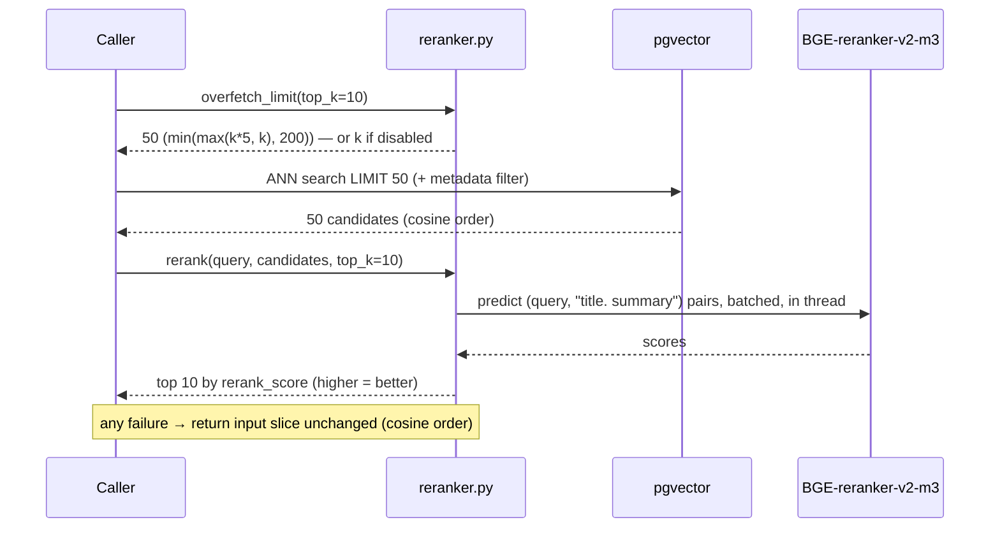

**Key parameters** (all env): `RERANK_ENABLED` (default **false**), `RERANK_MODEL` = `BAAI/bge-reranker-v2-m3`, `RERANK_OVERFETCH_FACTOR=5`, `RERANK_MAX_CANDIDATES=200`, batch 32, model `max_length=512`.

**Where.** `app/retrieval/reranker.py` — `overfetch_limit :69`, `rerank :142`, `score_pair :312` (single-pair sigmoid, shared with the relevance CE tier 2.1), `assign_exclusive :211` (margin-based exclusive article→scenario assignment, used by Forecast Assessment). Wired into every Auspex vector path (`auspex_tools.py:200`, `auspex_service.py:1163`, `:1276`) and Market Signals (`market_signals_routes.py:71` — reranks by a synthesized framing query so token-budget truncation keeps the signal-rich head).

**Spec-reuse notes.**
- The idiom for callers is always the same three lines: `fetch_k = overfetch_limit(limit)` → vector search with `fetch_k` → `rerank(..., top_k=limit)`. Copy it verbatim.
- Graceful degradation is a feature: rerank failure returns cosine order with no `rerank_score` key — callers must sort on `rerank_score` *with fallback*, minding 3.5.
- **Gotchas:** reranking is OFF by default, so cosine-order bugs are live in production; the CE truncates at 512 tokens despite a 4000-char text cap (long-body signal is lost); `rerank()` scores are raw logits (ordering only) while `score_pair()` is sigmoid [0,1] — never compare them.

## 3.3 Query Routing & LLM Query Expansion

**Problem.** Different query shapes (temporal trends, entity lookups, broad concepts, multi-facet questions) retrieve poorly through a single embedding.

**Mechanism.**

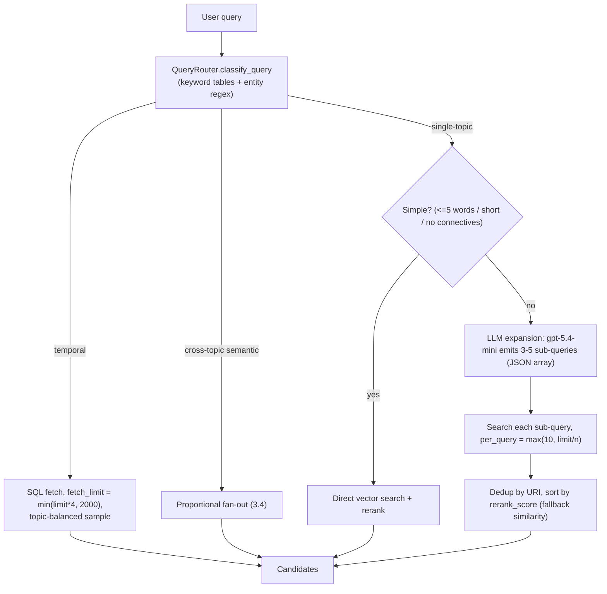

Also upstream of routing: pasted-template detection — messages > 500 chars with ≥ 2 instruction markers get a cheap LLM pass to extract the real search intent before anything is embedded.

**Where.** `app/services/auspex_service.py` — router `:841-1365`, classification `:883`, smart search `:1215`, expansion `:1326`, intent extraction `:2598`. Expansion failure → `[original_query]`; per-topic search exceptions counted as zero, never fatal.

**Spec-reuse notes.** The gate "only pay for expansion when the query is complex" and the fallback ladder (expanded → direct → SQL keyword search) are the reusable parts. In the chat path, if vector retrieval yields < 10 articles the whole strategy falls through to an LLM-generated structured SQL search (`:3051`) — a spec adding retrieval should define its own equivalent floor.

## 3.4 Cross-Topic Proportional Fan-out

**Problem.** "All Topics" semantic search must not let one large topic drown the others, and per-topic searches should run concurrently.

**Mechanism.** `calculate_topic_allocations` gives every topic `MIN_PER_TOPIC=10` then splits the remaining budget proportionally to corpus size; per-topic searches (each with its own overfetch + rerank) run under `asyncio.gather(return_exceptions=True)`; results dedup by URI and merge.

**Where.** `app/services/auspex_service.py:943-978` (allocation), `:1090-1147` (fan-out + merge).

**Spec-reuse notes.** The min-quota + proportional-remainder allocation is the house pattern for any per-topic budget split (also used by the temporal path and sampling strategies). **Gotcha:** the merge sort at `:1142` orders by raw `similarity_score` descending — which is a *distance* (see 3.5) — so the non-reranked merge path is inverted. Fix or avoid copying that sort.

## 3.5 Distance-vs-Similarity Convention (standing gotcha)

**Problem.** `search_articles` returns cosine **distance** (0 = identical … 2 = opposite) in a field that callers store as `similarity_score`. The name lies, and callers have handled it inconsistently — this is the single most recurring correctness bug in retrieval code.

**Rules for all new code / specs:**
1. Convert at the boundary: `sim = 1.0 - float(score)` immediately after search, and name the variable for what it holds (pattern done right: `bw_incident_enrichment.py:54,289` with `VECTOR_MIN_SIMILARITY = 0.55`).
2. `rerank_score` is always higher-is-better; raw `score` from pgvector is always lower-is-better.
3. Thresholds must state their space: `theme_proposer.py` keeps `distance <= 0.85`; story clustering keeps `distance <= 0.008` (sim ≥ 0.992) — both are distance thresholds by design.
4. Sorting `similarity_score` descending without conversion is a bug (live instances: `auspex_service.py:655, 673, 731, 786, 1142, 1250` fallback path).

---

# Part 4 — Auspex & Deep Research Agents

Two agents share one retrieval/sampling substrate: **Auspex Chat** (single-shot, tool-augmented, streaming) and **Deep Research** (six-phase autonomous pipeline). The saas backend has a third relative — the bounded tool-loop assistant in `saas.aunoo.ai/app/auspex/` — which follows the same patterns.

## 4.1 Single-Pass Tool-Augmented Chat

**Problem.** Answer arbitrary news questions grounded in the private article DB, with citations, at chat latency — no multi-step agent loop.

**Mechanism.**

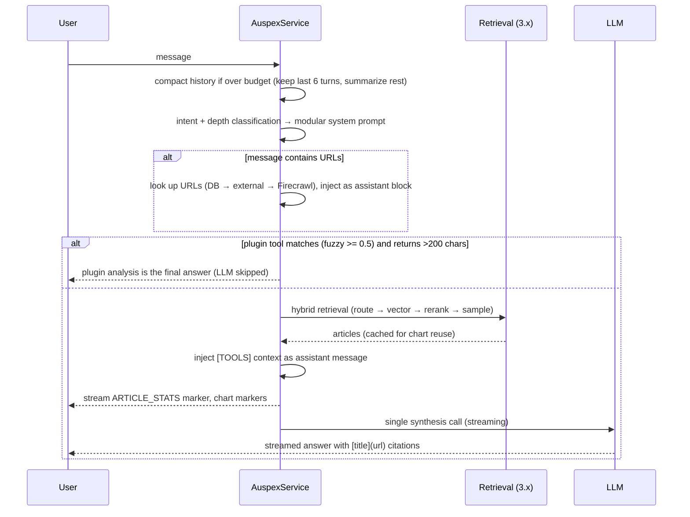

Key details: tool/context results are injected as **assistant** messages, never system, so they can't override system instructions; everything except pure greetings triggers retrieval ("the database should always be searched"); retrieved articles are cached on the service (`_last_chat_articles`) so a follow-up chart request doesn't re-run the search; structured data rides the SSE text stream as HTML-comment markers (`<!-- ARTICLE_STATS:...:END_STATS -->`) that the frontend demultiplexes.

**Where.** `app/services/auspex_service.py:1739-2008` (`chat_with_tools`); prompt assembly `:100-476` + `:2010` (org profile, topic ontology, tools status, content-separation rule); retrieval cascade `:2718-3451`.

**Spec-reuse notes.** The intent/depth classifier → modular prompt assembly (quick/standard/deep format blocks) is the cheap alternative to an agent loop — reuse it before reaching for multi-step. SSE marker multiplexing is the house convention for mixing structured payloads into a token stream.

## 4.2 Six-Phase Deep Research Pipeline

**Problem.** Produce a comprehensive, multi-objective, cited report autonomously — with observable progress, per-stage timeouts, and graceful partial failure.

**Mechanism.**

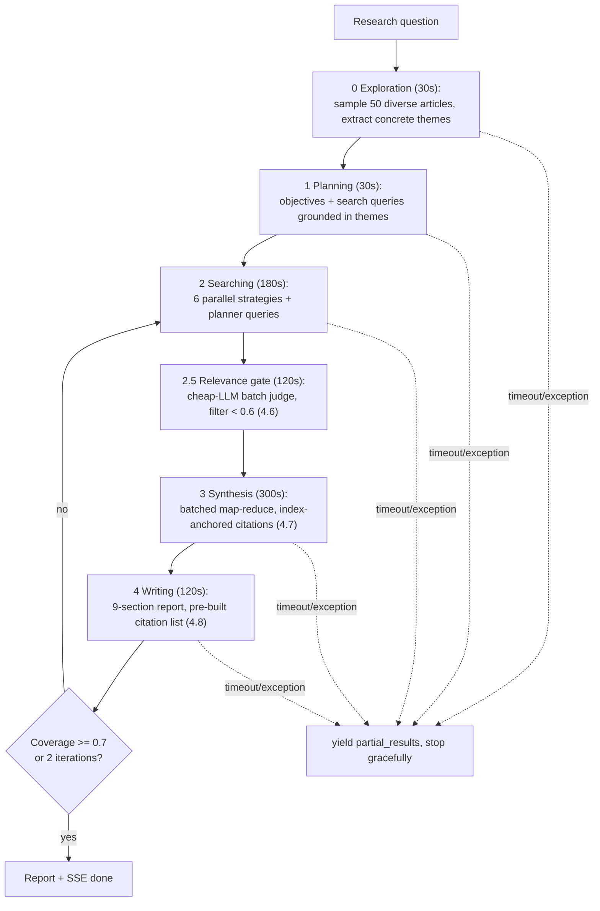

- Every stage is `asyncio.wait_for`-bounded and SSE-reports weighted progress (5/10/35/30/20%).
- The six parallel search strategies: semantic vector, **stratified temporal** (30% last-7d / 40% 8–30d / 30% 31–90d), category×bias, quality sources, future signals, cross-topic recent. Each article is tagged `_search_strategy` / `_objective_id` for later attribution.
- Config: `max_articles=500`, `articles_per_query=100`, `synthesis_batch_size=50`, `relevance_threshold=0.6`, `max_refinement_iterations=2`, `min_coverage_threshold=0.7` — overridable per request or via workflow YAML.

**Where.** `app/services/deep_research_service.py` — orchestrator `:275-481`, config `:134-238`, searching `:719-1047`, synthesis `:1289`, writing `:1746`.

**Spec-reuse notes.** The phase contract (bounded stage → SSE progress dict → partial-results on failure) is the template for any long-running generation feature. Note synthesis caps at 200 articles even when search collects 500 — the tail informs stats and sampling only; state such caps explicitly in specs (the "no silent caps" rule).

## 4.3 Corpus Exploration Before Planning

**Problem.** LLM planners generate abstract queries ("emerging trends in X") that embed poorly and return zero hits against a concrete news corpus.

**Mechanism.** Before planning, sample 50 diverse articles from the corpus, have a cheap model extract 5–10 **concrete themes** (specific entities, not abstractions), and inject sample titles + themes into the planner prompt with hard rules: queries MUST reuse words from actual titles; NO abstract concepts; NO year numbers. The planner is thereby grounded in what the corpus actually contains.

**Where.** `deep_research_service.py:483-540` (exploration), `:613-663` (theme extraction), `:2087-2157` (injection); reinforced by `data/auspex/agents/research_planner.md` with good/bad query examples.

**Spec-reuse notes.** Generalizes to any generate-then-retrieve flow: **show the generator a sample of the searchable space before letting it write queries.** Cheap (one mini-model call) and eliminates the most common deep-research failure (empty retrieval).

## 4.4 Context Budgeting: Cluster → Diversify → Compress → Fill

**Problem.** Fit the most useful articles into a model's context window — without near-duplicate redundancy, without monoculture (one category dominating), and without overflow.

**Mechanism.**

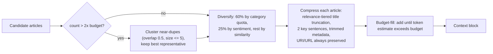

- Budget allocation ratios depend on query type and window size: mega-context models (≥ 500k) give 82–87% of the window to articles; standard models 60–75%. The context manager is re-instantiated per request with the actual model's window.
- Token estimation: 4 chars/token, tightened to 3 on Bedrock-routed models.
- Citation limits clamp to [5, 300], default 25.

**Where.** `app/services/auspex_service.py` — `OptimizedContextManager :479-838`, selection pipeline `:740-798`, compression `:569-599`, model-window table `:4010-4044`.

**Spec-reuse notes.** The order matters and is the reusable insight: dedup before diversity (or clusters eat the quota), diversity before compression (or you compress articles you'll drop), compression before fill (or the estimate is wrong). Compression must never strip `uri`/`url` — they're needed for citation links.

## 4.5 Pluggable Sampling Framework

**Problem.** Chat, deep research, and newsletters all need "pick N articles from M" with different priorities — as named, swappable presets rather than bespoke loops.

**Mechanism.** `app/services/sampling/` defines composable **filters** (topic, date, bias deviation, factuality tier, quality gate, near-dup Jaccard), **scorers** (source quality tiers, recency exponential decay with 3-day half-life, content quality, inverse-frequency diversity, semantic similarity — all 0–100), **strategies** (recency, quality, diversity round-robin, topic-balanced, semantic, weighted composite; default `recency_diversity` = 70% recent + 30% diversity fill), and a **registry** of named presets (`all_topics_default`, `quality_first`, `newsletter`, …) loadable from YAML. A pipeline runs filters in sequence (short-circuit on empty) then the sampler.

**Where.** `app/services/sampling/{strategies,filters,scorers,registry,pipeline}.py`; preset selection `registry.py:284`; deep-research composite use `deep_research_service.py:1250-1287` (cross-topic: TopicBalanced 0.4 / Semantic 0.3 / Diversity 0.3; single-topic: Semantic 0.4 / Quality 0.35 / Diversity 0.25; exception → simple truncation).

**Spec-reuse notes.** New features should reference a preset by name (or define one) instead of inventing selection logic — this is the designed extension point. **Gotcha:** four overlapping diversity mechanisms exist (this framework plus two legacy `_select_diverse_articles` and `ensure_diversity`); new code should use the framework only.

## 4.6 LLM Relevance Gate (batch judge before synthesis)

**Problem.** Vector recall pulls tangential articles (wrong geography, wrong entity, wrong era); feeding them to flagship-model synthesis wastes the expensive tokens and dilutes the report.

**Mechanism.** A cheap model scores articles **in batches of 10** (3 concurrent batches, temp 0.1) against the research question, returning per-article `score + reasoning`; articles below 0.6 are dropped before synthesis. Failure-safe: on parse/timeout errors, articles get a neutral 0.5 and are **kept** (an unavailable judge must not empty the pipeline). Cross-provider model fallback is built in.

**Where.** `app/services/relevance_scorer.py` (batch `:50`, threshold applied at `deep_research_service.py:369-414`); model env `RELEVANCE_MODEL`, default `gpt-5.4-mini` → Bedrock Haiku on this tenant.

**Spec-reuse notes.** This is the runtime (per-question) sibling of the ingest-time cascade (2.1) — use it whenever candidates were retrieved for an *ad-hoc* question that stored alignment scores can't answer. Batch-of-10 with per-article numbered output is the cost sweet spot; fail-open (keep on error) is the correct default for a filter feeding a later human-reviewed stage.

## 4.7 Batched Map-Reduce Synthesis with Index-Anchored Citations

**Problem.** 200+ articles exceed one synthesis call, and findings must trace to real source articles — an LLM asked to quote URLs will mangle or invent them.

**Mechanism.**

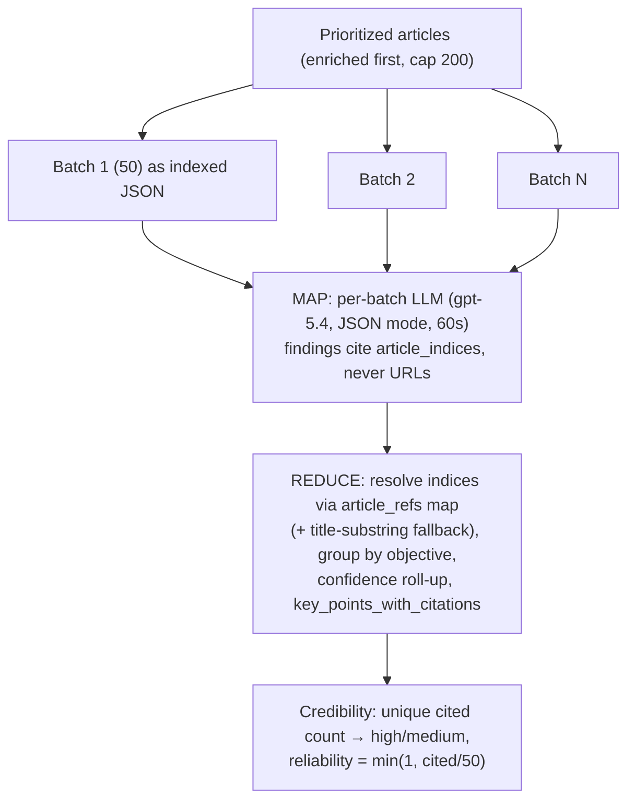

- The map prompt hands each batch as `{index, title, url, summary[:500]}` and demands findings referencing `article_indices` + `article_titles`. Fabricated indices simply fail to resolve in reduce — hallucination becomes a no-op instead of a bad link.
- Per-batch timeout/JSON errors skip that batch; the pipeline continues with what succeeded.
- Global metadata stats (sentiment/category/signal counts) are computed once in code over all articles — the LLM narrates, it never counts.

**Where.** `deep_research_service.py:1289-1568` (map), `:1570-1696` (reduce).

**Spec-reuse notes.** **Index-anchored citation is the house answer to citation hallucination** — give the model small integers, resolve them yourself. Combine with 4.8's writer-side defenses. "The LLM never does arithmetic/counting; code computes stats, the model narrates them" is a rule worth restating in any analytics-narration spec.

## 4.8 Layered Hallucination Defenses

**Problem.** LLMs fabricate URIs, invent sources, and over-claim when retrieval comes back thin. No single defense suffices.

**Mechanism — five layers, outermost first:**
1. **Prompt-level:** core prompt mandates "if no articles found, state this — never hallucinate"; entity questions are verified against both vector and SQL stores before answering, with an explicit "0 articles" response when truly absent.
2. **Input-level:** synthesis receives indexed article objects, and the writer receives a pre-built numbered citation list of real titles+URLs (assembled to 75, sliced to 50 in the prompt) — the model is never asked to remember a URL.
3. **Reference-level:** index-anchored citations (4.7) make fabricated references unresolvable.
4. **Output-level:** post-hoc source attribution regex-locates the References section and tags each line `*(internal)*`/`*(web)*` from a URL→source map, with domain-level fallback.
5. **Ledger-level (observer agents):** LLM-echoed URIs are normalized and validated against the exact candidate set that was in the prompt (5.2).

**Where.** `auspex_service.py:196-199, 419, 2903-2931, 3041-3045`; `deep_research_service.py:1995-2085`; writer contract `data/auspex/agents/report_writer.md`.

**Spec-reuse notes.** Specs for any citing feature should state which layers apply. Minimum bar for anything user-facing: layers 2 + 3 (never ask a model to reproduce a URL; always resolve references from your own map).

## 4.9 Coverage-Gap Refinement Loop

**Problem.** The first search pass may not cover all research objectives; blind iteration wastes money.

**Mechanism.** After synthesis inputs are gathered, a cheap model scores per-objective coverage 0–1 and lists gaps with suggested queries. If overall coverage < 0.7, the suggestions become new (internal-preferred) queries, results are appended and deduped, and the loop repeats — at most 2 iterations. Termination is therefore "measured coverage ≥ threshold OR iteration cap," never "the model feels done."

**Where.** `deep_research_service.py:976-1038` (loop), `:2198-2294` (assessment), `:2296-2335` (query generation).

**Spec-reuse notes.** The reusable contract for any agentic retry loop: an explicit, cheap, *measurable* stop condition plus a hard iteration cap. Also note the adaptive source preference in the searching stage: once the parallel pass yields ≥ 150 internal articles, the planner's queries prefer internal over web (`:837`); refinement queries always target the internal store.

---
# Part 5 — Observer Agents & Screening

## 5.1 Natural-Language Signals Evaluated by LLM over Batches

**Problem.** Analysts want monitoring intent in plain English ("flag anything suggesting a competitor is about to acquire a rival"), not boolean keyword rules — evaluated on a schedule over a rolling article window, without re-reporting the same article twice.

**Mechanism.**

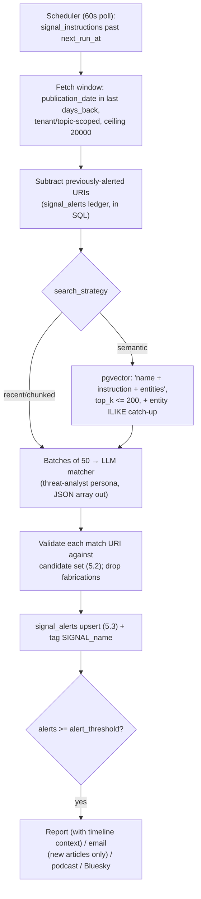

- The matcher returns per-article `{article_uri, signal_detected, confidence, summary, reasoning, threat_level, recommended_action}`; empty array when nothing matches. Batch-level JSON errors never abort the run.
- **Window over cap:** the scheduled path fetches the *whole window* minus already-alerted URIs (ceiling 20000), not `LIMIT max_articles` — a former 1000-row cap silently hid most of high-volume windows (comment at `vector_routes.py:3959`).
- Reports get a situational timeline block (timeline_rollup) so they distinguish new vs ongoing, and a persona prefix scoping recommendations to actions *the reader* can take (never "governments should…" — standing policy, memory `project_recommendation_audience_scoping`).
- Multi-agent runs send ONE combined email, not per-agent emails.

**Where.** `app/routes/vector_routes.py` — endpoint + inline path `:3997-4906`, scheduled internal path `:5046+`, request model `:3938`; scheduler `app/tasks/observer_agent_monitor.py` (due query `:89`, next-run calc `:32`, 60 s loop `:225`). SaaS equivalent: `saas.aunoo.ai/app/agents/executor.py` (adds keyword/entity pre-filters before the LLM, per-plan article caps, always files a structured `AgentBrief` — quiet briefs cost no LLM call — and fans out by plan feature).

**Spec-reuse notes.**
- The saas executor is the cleaner reference implementation for new work (pre-filters → LLM only on survivors → structured brief → gated fan-out).
- **Gotcha:** the monolith's inline endpoint path and scheduled internal path duplicate the prompt/parse logic — fixes must land in both. Run status lives in an in-process dict (lost on restart).
- The LLM wrapper never raises — failures return a `"⚠️ …"` sentinel string that every consumer must check.

## 5.2 Hallucinated-URI Defense (candidate-set gate)

**Problem.** Models mangle URIs while copying them into match JSON (~10% — dropped trailing slashes, added/removed `www.`) and sometimes fabricate URIs entirely. Saving alerts under nonexistent URIs breaks repeat suppression permanently.

**Mechanism.** Before the LLM call, build `norm_uri_lookup = {normalize(uri): original_uri}` over the exact candidate set in the prompt. `_normalize_uri` lowercases, strips whitespace, trailing `/`, `http(s)://`, and leading `www.`. Every URI the LLM returns is normalized and looked up; a miss means the match is logged and **discarded**. The model cannot introduce a URI that wasn't in its input.

**Where.** `app/routes/vector_routes.py:3966-3977` (`_normalize_uri`), gates at `:4296-4302` and `:5336-5342`.

**Spec-reuse notes.** Mandatory for any feature where an LLM selects items from a list by identifier. The general form: **echo-validate every identifier an LLM returns against the set you gave it, after normalization.** Prefer small integer indices (4.7) where possible; use normalize-and-lookup when the identifier must be the URI.

## 5.3 Alert Ledgers: Upsert Dedup + Content-Identity Keys

**Problem.** Scheduled evaluations re-run every cycle while their trigger conditions stay true. Time-bucketed dedup keys re-fire the same alert every bucket; naive inserts duplicate rows. Alerts must be keyed on *what fired them*, and only genuinely new content may re-fire.

**Mechanism — three cooperating ledgers:**

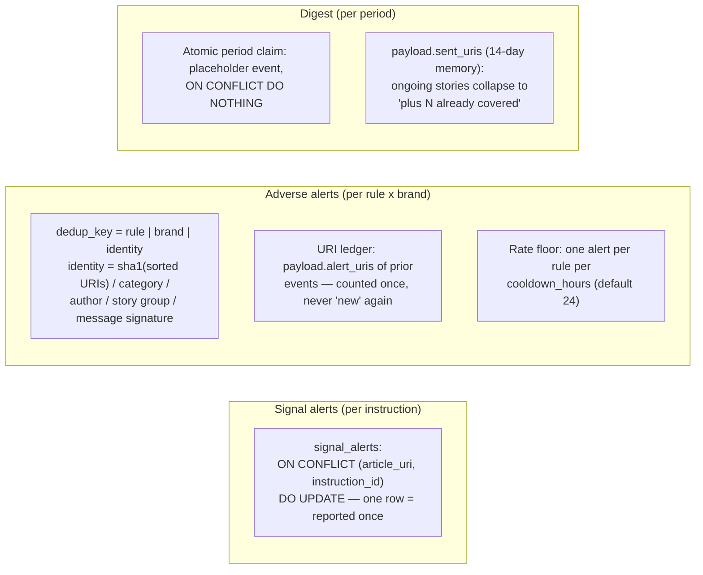

- Adverse-media rules (10 of them) each subtract the URI ledger from their candidate set, require `>= min_new`, and key the event on content identity (`brand_watcher_monitor.py:442-542` — table of dedup_key formats per rule). State alerts (e.g. net-negative sentiment) fire on *entering* the state and re-fire only on worsening by a configured delta.
- `_dedup_exists` checks the key **before** composing the alert body, so a duplicate never costs an LLM call.
- Ledgers live inside event-row JSONB payloads, read back via `jsonb_array_elements_text` — no separate ledger tables.

**Where.** `database_query_facade.py:6519` (signal upsert); `brand_watcher_monitor.py:466-542` (adverse identity dedup); `bw_digest_service.py:108-434` (digest memory + period claim). Related: story clustering (`brand_watcher_stories.py:88` — greedy, oldest-first, canonical URI as group id, distance ≤ 0.008) collapses syndicated copies so identity keys operate on stories, not copies.

**Spec-reuse notes.** The design rule (from the incident that produced it): **dedup keys encode content identity, never time buckets** (memory `project_bw_alert_identity_dedup`). Any recurring evaluator spec must answer three questions: what is the identity of an event, where is the sent-ledger, and what is the rate floor.

## 5.4 Five-Signals Composite Screening

**Problem.** One adverse-media article must be assessed on several independent axes (is it credible? corroborated? spreading? organically?) where any single data source may be down — without failing the whole assessment.

**Mechanism.**

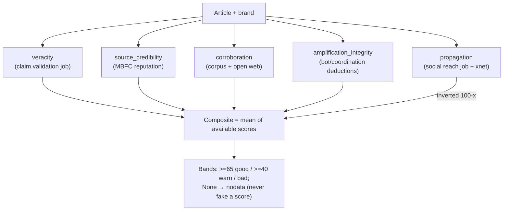

- Signals come from two remote MCP engines (saas validation + social reach) run as background jobs with a fast-poll ramp (3/5/8 s then advertised cadence; 600 s ceiling).
- Each signal degrades independently to `nodata`; the composite averages whatever is available. Propagation is a *magnitude* (log-scaled reach), entered inverted so the composite reads uniformly as "screen health."
- Partial-run merge: prior signal payloads are kept via `COALESCE(EXCLUDED.x, existing.x)` upserts, so running reach today and claims tomorrow recomposes over the union.
- Auto-screening of new high-severity findings is budget-capped (2/cycle, 10/day) to bound spend.
- Domain guard: cross-network pickup only counts posts that actually share the article (URL needle or ≥25-char headline quote) — keyword search otherwise inflates one real share into dozens of noise posts.

**Where.** `app/services/bw_signals_service.py` — orchestrator `:704`, signal composers `:416-622`, composite `:625`, merge upsert `:669`; auto-screen `brand_watcher_monitor.py:995`.

**Spec-reuse notes.** The template for any multi-source scoring feature: per-signal `score | None` with explicit `nodata` band; composite over available signals only; magnitude signals inverted into health space; COALESCE-merge for partial refreshes; never hold a DB connection across the minutes-long remote polling (fresh short-lived connections; pgbouncer reaps idle ones).

## 5.5 Staged Review Queue (agent proposes, analyst applies)

**Problem.** An enrichment agent should gather and rank candidate evidence, but the destination (a hash-chained evidence locker) is append-only and unpurgeable — agent output must never land there directly, and dismissed items must never be re-proposed.

**Mechanism.**

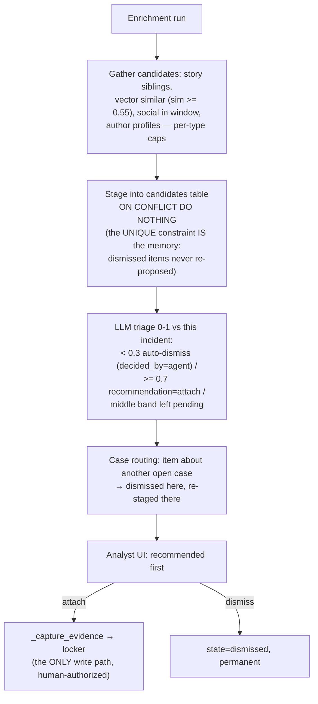

- The same run also writes an LLM brief (stored on the run row, attach only on request), deterministic merge/severity suggestions posted as timeline events (severity auto-adjust fires at most once, never after a human severity change), and kicks Five-Signals screening concurrently so remote jobs overlap the gather phase.
- The saas affiliation recommendations queue (6.8) is the same shape with a content-hash dedup key making apply/dismiss decisions permanent across nightly regenerations.

**Where.** `app/services/bw_incident_enrichment.py` — orchestrator `:887`, staging `:398`, triage `:513` (chunk 25, max 80/run); analyst decide route `brand_watcher_routes.py:5992`; auto-enrich scheduling (budget-capped 1/cycle, 8/day) `brand_watcher_monitor.py:1039`.

**Spec-reuse notes.** This is principle 5 in canonical form. A spec using it must define: the staging table + UNIQUE key (which doubles as re-proposal memory), the triage thresholds and who `decided_by` records, the single human-authorized write path, and budget caps for autonomous runs. Runs never raise (BackgroundTasks targets) — failure lands as status on the run row.

## 5.6 Stance Supervisor (brand-as-actor vs brand-as-target)

**Problem.** Social monitoring has two distinct failure modes: coincidental name matches / spam, and *false negativity* — a post that is negative in tone but where the brand is the one acting (suing someone, winning a dispute), so the negativity targets the other party.

**Mechanism.** Two-pass evaluation on a cheap model:
1. **First pass:** one call returns `{relevance 0-1, sentiment}` with prompt rules for spam/ads (score ≤ 0.1 even when they name brand products) and a no-mention cap: if the post never mentions the brand (name/variant/product/@handle/#hashtag/ticker), relevance ≤ 0.3 — *programmatically enforced* by deriving the distinctive brand token and word-start matching, not just prompted.
2. **Supervisor pass** (negative posts only): a stricter prompt answers two booleans — `negative_toward_brand` (key clause: *if the brand is the one acting, the negativity is directed at the other party — answer false*) and `spam_or_solicitation`. A false/spam verdict downgrades stored sentiment so adverse-alert rules (5.3) don't fire on brand-as-actor posts.

Robustness: 90 s hard call timeout (a wedged provider socket must not stall the batch), concurrency 6, tolerant JSON parsing with clamping; unreachable model → posts stay unscored and are retried by an hourly sweep.

**Where.** `app/services/social_eval_service.py` — first pass `:33`, mention cap `:85`, supervisor `:56`, tolerant JSON parsing `:102-138`, timeout constant `:27` (applied `:178`, `:222`). Deployed to all tenants (memory `project_social_eval_stance_fix` — this was a prompt fix, not a model upgrade).

**Spec-reuse notes.** Two generalizable moves: **enforce prompt rules in code where possible** (the mention cap), and **run a second, narrower judge only on the expensive-to-get-wrong subset** (negatives) instead of upgrading the model for all traffic.

## 5.7 Damped Risk Scoring with Baseline Honesty

**Problem.** Composite risk scores computed over thin windows inflate: an empty baseline period makes any activity read as an infinite spike (the 100/100 incident), and small samples manufacture trends.

**Mechanism.**
- `risk_score = min(100, recent_neg_pct × 1.5 × sample_damp + max(0, neg_trend) × 2 × trend_damp + alerts × 5 + high_alerts × 10)` — only a *worsening* trend adds risk.
- `sample_damp = min(1, recent_n/20)`; `trend_damp = sample_damp × min(1, baseline_n/20)` — the trend term is damped by **both** periods' sample sizes.
- **Empty-baseline fix:** if the in-window baseline is empty, query the 28 days *before* the window instead of treating baseline as 0%.
- **No-data honesty:** if there is still no baseline, the trend is zeroed and the narrative is explicitly instructed "do not claim an increase or decrease"; a LOW SAMPLE caveat is appended below 20 recent articles.

**Where.** `app/routes/brand_watcher_routes.py:3673-3739` (formula lives in 3 files across BW tenants — memory `project_bw_risk_score_fix`).

**Spec-reuse notes.** Any composite score spec should carry all three clauses: sample damping on every ratio term, a pre-window baseline fallback, and an explicit no-claim rule when the baseline is genuinely absent. LLM narrations of scores must receive those caveats in-prompt.

---
# Part 6 — SaaS Generation Patterns

The saas backend (`/home/orochford/tenants/saas.aunoo.ai`) evolved several patterns beyond the monolith; some (usage ledger, fallback design) have already been back-ported. These are the reference implementations for new work.

## 6.1 Use-Case Model Routing with Quality Gates

**Problem.** One wrapper must route every LLM call by *purpose* (not call site), survive provider throttling, upgrade models per tenant tier, and refuse to return garbage.

**Mechanism.** Every call goes through `get_completion(use_case=...)`:

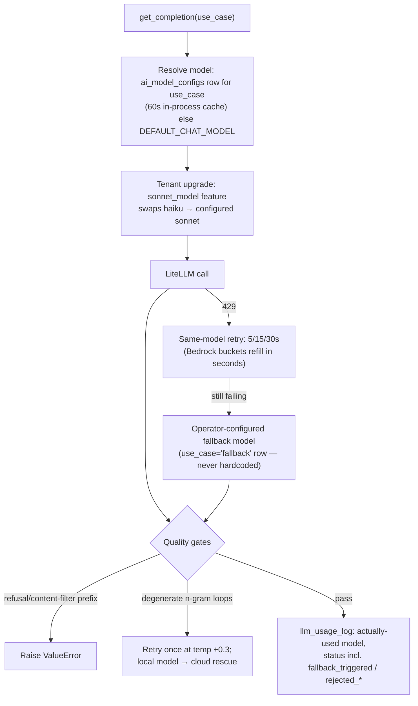

- Only `RateLimitError | AuthenticationError | APIConnectionError` trigger cross-model fallback; `BadRequest`/`ContextWindowExceeded` pass through (they'd fail identically elsewhere).
- Degenerate-output detection exempts structured-JSON use-cases whose legitimate schema repetition would false-positive; JSON-parseable output auto-skips the check.
- Embeddings are local DeBERTa 768-d with **no cloud fallback by design** — every pgvector column is `vector(768)`; a 1536-d fallback would silently corrupt writes. Fails loud. (**wiley** is the last 1536-d monolith tenant and still falls back to random vectors, 3.1. That fallback is logged, but it is returned and stored like a real vector, which is what makes it dangerous. **wileytest is the exception**: it runs the same local-DeBERTa 768-d design as saas and raises rather than fabricating a vector. Fail-loud is the correct behaviour, and it is not saas-only.)

**Where.** `saas.aunoo.ai/app/ai/llm.py` — resolution `:119`, tenant override `:217`, rate-limit retry `:262`, fallback `:307`, gates `:617+`, ledger `:443`, embeddings `:998`.

**Spec-reuse notes.** New saas features must name their `use_case` string — it drives model choice, fallback, cost attribution, and the degenerate-check exemption list. **Gotcha:** provider content can arrive as a list of parts; coerce before string checks (a list once silently bypassed the refusal filter).

## 6.2 Output Contract (never cache invalid content as success)

**Problem.** A parse failure that yields an empty-but-cacheable result is worse than an error: it shadows good stale data for the full TTL (the 0-theme newsfeed incident).

**Mechanism.** An `OutputContract` object collects violations for one generation stage (`require`, `require_nonempty_list`, `require_text(min_words=)`, `require_in`) and logs a single greppable `OUTPUT CONTRACT VIOLATION` line. On violation: **fail loudly, do not persist** — readers keep serving the previous (possibly stale) cache entry. A check belongs in the contract only when its failure means the content is *unusable*, not merely imperfect.

**Where.** `saas.aunoo.ai/app/ai/contracts.py:35`; used by consensus (`app/newsfeed/consensus_service.py:170`), horizons (`horizons_service.py:194`), incidents (`highlights_service.py:293`).

**Spec-reuse notes.** Every generation-into-cache spec should list its contract assertions explicitly (e.g. "≥1 category, each with ≥3 citations"). Pair with 6.3 so a failed generation degrades to stale rather than empty.

## 6.3 Stale-Fallback Cache + Global Pregeneration + Gap-Fill

**Problem.** Per-tenant × per-topic LLM generation is O(N×M) cost, and users must never see an empty "needs generation" state.

**Mechanism.**
- **Cache:** key `{kind}_v{n}_{topic_id}_{days}` in `analysis_cache`. Reads use `allow_stale=True` — expired rows are returned tagged `stale=True` ("yesterday's analysis beats an empty state"); generate paths use fresh-only so stale still regenerates. A **window-agnostic fallback** serves any cached window for the topic when the exact `(topic, days)` key misses, tagged `window_used`.
- **Global pregeneration:** centrally-curated analyses (consensus, horizons) generate ONE cache row per `(kind, topic, window)` for the whole platform — not per tenant. A 30-min poller generates once per cadence day; target set = union of skill-pack default topics AND subscribed topics (both halves needed — the mismatch was a real empty-cache bug).
- **Gap-fill self-healing:** each wakeup regenerates topics whose cache is missing/expired (cap 30/run, once per kind per hour) — missed runs, failures, and new packs heal within one wakeup instead of a day.
- **TTL discipline:** TTL = cadence + grace (daily=25 h, weekly=8 d, monthly=32 d) — cache must outlive the run gap or reads flip stale every cycle.
- **Run audit:** every run writes per-topic ok/failed/skipped outcomes; run status derived from counters.

**Where.** `saas.aunoo.ai/app/newsfeed/consensus_service.py:414` (window-agnostic), `app/tasks/foresight_task.py` (loop `:61`, per-cadence check `:81`, targets `:241`, gap-fill `:185`), `app/newsfeed/foresight_runs.py` (TTL `:32`).

**Spec-reuse notes.** The four-piece kit (stale-fallback read, fresh-only generate, gap-fill, TTL = cadence + grace) is the standard for any scheduled generation. Specs should state whether output is per-tenant or global-once — global-once is the default for identical-input analyses.

## 6.4 Timeline Mementos / Worldstate Grounding

**Problem.** LLMs hallucinate stale world knowledge (wrong heads of state, "former President X"). Every generation needs a compact, current, token-budgeted snapshot of "what's true now."

**Mechanism.** `build_timeline_context(topic_id, token_budget)` assembles, within budget: the topic's rolling state-doc summary + trend; short entity-wiki summaries for its key entities (so the model knows *current* actors); then events by granularity — analyst notes (permanent, never stale), latest monthly rollup, last 4 weekly, last 7 daily. Budget enforcement drops oldest daily first, then weekly, **never** analyst notes or monthly. A topic-agnostic `build_global_mementos_block` serves prompts not scoped to one topic. As-of timestamps are exposed so assistants can caveat freshness.

**Where.** `saas.aunoo.ai/app/timeline/context_builder.py` — `:24` (topic), `:240` (global), budget `:149`. Consumers: horizons (budget 500), agent evaluation (600), incidents (500), editorial worldstate (global 800 + per-topic 500). Monolith port exists for BW tenants (memory `project_timeline_mementos`) but is **not** yet wired into Auspex/reports there.

**Spec-reuse notes.** Inject this block into any prompt that reasons about the present. The budget hierarchy (curated > rolled-up > raw recent) is the reusable rule. **Gotcha:** read the topic name in a separate short-lived session — never hold a DB transaction across the downstream LLM call.

## 6.5 Editorial Pipeline (curator + fact preflight + editor review)

**Problem.** Turn many correspondent briefs into one coherent, continuity-aware front page — recomputed as briefs arrive, serialized across workers, and hallucination-gated before publication.

**Mechanism.**

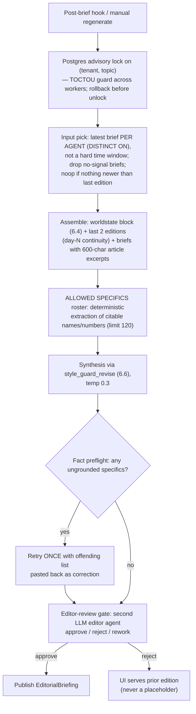

- Recency-vs-signal picking: latest-per-agent beats a strict `period_hours` window (agents file on their own cadence; a hard window starves the editor) — the "RECENCY beats alignment" lesson from memory `project_briefing_compose` generalized: pick inputs by *who has something new*, not by a single threshold.
- Article excerpts are load-bearing: title+URL alone produced ~75% fabrication-rejection at review.
- Every run writes an observability row with reason codes (`llm_returned_empty`, `editor_verdict:*`, `no_new_briefs_since_last_edition`).

**Where.** `saas.aunoo.ai/app/briefings/editor_service.py` — lock `:347`, pick `:175/:469/:500`, roster + preflight `:643/:719/:798`, review gate `:844`; shared draft-review agent `app/analyst/draft_review_service.py:335`; live feed + SSE room `app/today/service.py:158/:518`.

**Spec-reuse notes.** Four independently reusable pieces: the advisory-lock serialization idiom; deterministic-roster + preflight-retry (bound what the model may cite, verify, retry once with the diff); the generate→review→publish gate with prior-edition fallback; and reason-coded run rows for observability.

## 6.6 Style Guard / AI-Tells Self-Policing

**Problem.** The platform's own LLM output can read as AI slop; the same heuristics that scan third-party articles for AI-writing tells should police our generations (policy: memory `feedback_no_ai_slop`).

**Mechanism.** A pure-heuristic detector scores text against a DB-backed rules bundle (`tells_per_100w`, structural counts). Three integration points:
- `build_anti_patterns_block()` — an ~85-token prompt fragment (avoid "delve"/"tapestry", em-dash limits, name actors and numbers) prepended to synthesis prompts.
- `style_guard_revise(llm_fn, ...)` — scan-and-revise loop: if output trips the calibrated threshold (3.0 tells/100w AND 3 structural), re-prompt once with the named worst tells + suggestions; return whichever attempt scores lower. Max 2 calls.
- The article-scanner verdict ("ai / mixed / human") uses the same calibration, keeping product claims and self-policing consistent.
- Optional external pass: `humanize-mcp`'s `humanize_text(preset="news")` on final drafts, threshold-gated (WILEY_HUMANIZE), skipped when unavailable.

**Where.** `saas.aunoo.ai/app/services/ai_tells/{detector,verdict,style_guard,rules_cache}.py` — thresholds `style_guard.py:37`, revise loop `:159`.

**Spec-reuse notes.** Cheap (heuristic scan + at most one revision call) and composable — specs for any prose-generating feature should route the final call through `style_guard_revise` and prepend the anti-patterns block.

## 6.7 Async Job Queue Wrapping Long LLM Work

**Problem.** MCP tools (and web requests) have a ~25 s window; newsletter generation (~13 min), article validation (1–2 min), and deep social analysis overrun it — and on timeout never populate their cache, so retries fail identically.

**Mechanism.**

```mermaid
sequenceDiagram
    participant T as Tool call (MCP/UI)
    participant J as skills_jobs table
    participant W as Worker loop (5s poll)
    participant H as Handler
    T->>J: insert SkillsJob(pending) — inputs validated under caller RLS first
    T-->>T: return job_id + poll_with + poll_every_seconds
    W->>J: claim <= 3 oldest pending (BYPASSRLS scan)
    W->>H: run under tenant-scoped session (RLS applies), wait_for 20min
    H-->>J: succeeded(result) / failed(error)
    Note over W,J: reaper fails rows 'running' past timeout+5min<br/>(crash/cancel wedges); asyncio.shield on bookkeeping
    T->>J: poll tool → result only when succeeded
```

- Doomed requests (bad article id, cross-tenant) fail at **enqueue**, not after a poll round-trip.
- Handlers reuse the exact interactive engines (the newsletter handler drains the same staged async generator the UI streams; validation reuses the multi-agent validation supervisor) — one implementation, two transports.
- Stray non-shutdown `CancelledError` (buggy anyio teardown) is logged and survived, not treated as shutdown — this is the xpoz-429/anyio cancel-scope fix's home (memory: saasmvp still latent elsewhere).

**Where.** `saas.aunoo.ai/app/tasks/skills_jobs_loop.py` (worker `:105-303`), enqueue/poll tools `app/auspex/tools.py:879-1749`.

**Spec-reuse notes.** Use for anything over ~20 s behind a request boundary. A spec must define: job type + args schema, validation done at enqueue, the poll contract (`result` only on success), timeout + reaper window, and RLS posture (BYPASSRLS scan / tenant-scoped execution).

## 6.8 Deterministic Detection → LLM Review → Recommendation Queue

**Problem.** Coordination/affiliation detection must be *durable* (one-off co-publication is noise), explainable, and its findings must become applyable actions whose accept/dismiss decisions survive nightly regeneration.

**Mechanism — a three-layer funnel where the LLM only ever sees pre-computed facts:**
1. **Deterministic detection:** Stage-1 near-copy (pgvector cosine ≥ 0.92 **plus** a ≥2-shared-title-token sanity gate — embeddings alone false-positive on genre) and Stage-2 shared-citation (≥2 shared `(kind, value)` citation tuples in 24 h). Wire credits (`"(Reuters)"` datelines, "Reporting by …") are regex-extracted at ingest and **excluded** from coordination evidence — subscriber wire pickup is ordinary journalism, not affiliation. Non-discriminating domains (apnews, prnewswire, youtube…) are excluded from citation rankings, with Python and SQL filters kept in sync from one list.
2. **Consensus accumulation:** daily idempotent re-clustering of a fixed canonical window; per-pair `affiliation = together_runs / opportunity_runs` denoises; read-time Louvain (seeded, deterministic) over high-affiliation edges with tenure requirements (≥10 opportunity runs, ≥0.5 affiliation, ≥14-day span). Membership explained in precedence order (alias → agency → wire → … → `unexplained_copy`) so structural artifacts never read as findings; a group whose coordination events ≥50% carry the same wire_credit is retagged `wire`.
3. **LLM review + queue:** facts are assembled deterministically (the model never sees raw articles); one LLM call writes the sectioned review; a *second* extraction call turns the prose into structured recommendations staged `status='proposed'` with a **content-hash dedup key** (rec_type + domains + target) — apply/dismiss decisions are permanent across nightly regenerations. Analyst apply routes map onto existing write paths. Nightly auto-generation + opt-in alerts (new high-cohesion unexplained groups only, signature-deduped against all prior reports); alert failures are swallowed — alerting must never break report generation.

**Where.** `saas.aunoo.ai/app/tasks/propagation_detection_task.py` (:92, :256), `app/detection/citations.py` (:190, :282), `app/analyst/affiliation_tracking.py` (:145, :330), `app/analyst/propagation_routes.py` (:3283-3758). Full operational detail: memory `project_affiliation_recommendations`.

**Spec-reuse notes.** The layering is the point: deterministic evidence → durable statistics → LLM narration → staged recommendations. LLMs narrate and extract; they never detect, count, or apply. The two-call split (narrate, then extract structured recs from the narration) keeps each prompt simple and independently testable.

---

# Part 7 — Cross-Cutting LLM Infrastructure

## 7.1 Alias-Based Model Routing (litellm yaml)

**Problem.** ~18 call sites hardcode model names like `gpt-5.4-mini`. Repointing all traffic (e.g. to Bedrock) must not touch call sites, and the mapping must be editable without restart.

**Mechanism.**

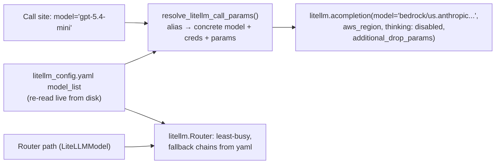

- Aliases deliberately mirror upstream OpenAI names so legacy call sites resolve; tiers: flagship names → Sonnet, mini/nano names → Haiku, plus canonical `bedrock-claude-*` and `nova-lite`/`nova-pro` aliases.
- Every Bedrock-**Claude** entry (the gpt-*/claude-*/gemini-*/mixtral aliases) carries `thinking: {"type": "disabled"}` and `additional_drop_params: ["reasoning_effort", "response_format"]`; the `nova-lite`/`nova-pro` entries instead drop thinking entirely via `additional_drop_params: ["reasoning_effort", "response_format", "thinking"]` (no `thinking` key). Without one of these, the gpt-5.x code path's injected `reasoning_effort` becomes an Anthropic thinking budget Bedrock rejects, silently killing calls.
- Fallback chains in the yaml are re-read at failure time (live edits work); the Router's constructor-time copy is stale until instance rebuild.

**Where.** `app/config/litellm_config.yaml`; `app/ai_models.py` — resolver `:50`, config merge `:391`, router `:517`, app-level fallback traversal `:716`. Nova cost directive: yaml `:193-207`. Bedrock-only tenant recipe: memory `reference_bedrock_only_tenant`.

**Spec-reuse notes.** New code must either use `AIModelFactory`/`LiteLLMModel` or wrap direct calls in `resolve_litellm_call_params()` — a bare alias passed straight to litellm bypasses routing and lands on the name-inferred provider (residual bypasses exist, e.g. `summarization_service.py:188`; the usage ledger still catches them for cost, but not for routing). Nova aliases go **inside** `model_list` (memory `project_relevance_retrain_ledger`).

## 7.2 Severity-Classified Errors, Retry & Circuit Breaker

**Problem.** Different LLM failures demand different responses; retrying a dead provider hammers it and stalls pipelines.

**Mechanism.**

```mermaid
flowchart TB
    ERR[LLM exception] --> CLS{LLMErrorClassifier}
    CLS -- "Auth / Budget" --> FATAL["FATAL: raise PipelineError, stop"]
    CLS -- "RateLimit / Timeout / Connection" --> REC["RECOVERABLE: backoff retry<br/>(3x base 2s / 2x base 1s, jittered)<br/>then fallback model"]
    CLS -- "ContextWindow / BadRequest / SchemaValidation" --> SKIP["SKIPPABLE: skip item or straight to fallback"]
    CLS -- "ServiceUnavailable / APIError" --> DEG["DEGRADED: fallback model"]
    CLS -- unknown --> FATAL2["Unknown → FATAL (fail-safe)"]
```

```mermaid
stateDiagram-v2
    CLOSED --> OPEN: 5 consecutive failures
    OPEN --> HALF_OPEN: after 300s
    HALF_OPEN --> CLOSED: success
    HALF_OPEN --> OPEN: failure (max 3 test attempts)
    note right of OPEN: State persisted to DB (survives restarts). While open, calls go straight to fallback.
```

- Router-level retries are deliberately 0 — all retry lives in this app layer, so there's no double-retry.
- When no fallback remains, the wrapper returns a user-visible `"⚠️ …"` sentinel string rather than raising — every consumer checks for it (a house convention; specs must mention it).
- The saas wrapper (6.1) refines this: same-model retry first for Bedrock 429s (buckets refill in seconds), fallback only on the three transport errors, fallback target operator-configured.

**Where.** `app/exceptions.py:12-72` (taxonomy), `app/ai_models.py:772-1048` (handling), `app/utils/circuit_breaker.py` (`FAILURE_THRESHOLD=5`, `TIMEOUT=300s`, DB-persisted), `app/utils/retry.py` (jittered exponential backoff).

## 7.3 Per-Call Usage Ledger via Callbacks

**Problem.** No per-call cost tracking → the ~$8.6k July 2026 AWS bill surprise. One choke point must capture *every* call — router, direct, and alias-bypassing.

**Mechanism.** Global litellm success/failure callbacks normalize each call into a bounded in-memory queue (10k; overflow drops and counts — a DB hiccup never breaks an LLM call); a daemon flusher batch-inserts (≤500 rows / 5 s) into `llm_usage_log` (use_case, model, resolved model, provider, tokens, cost, latency, status). Cost resolution: litellm response_cost → `completion_cost()` → static price table. Caller attribution walks the stack for the first app-owned frame (`module:function`). Installed at app startup before any background task can call.

**Where.** `app/services/llm_usage_logger.py` (install `:206`, extract `:90`, price table `:47`); installed `app/core/app_factory.py:64`. Ported from the saas original (`app/ai/llm.py:_log_usage`). Query idiom: `SELECT use_case, model, count(*), sum(cost_usd) FROM llm_usage_log WHERE created_at > now() - interval '7 days' GROUP BY 1,2 ORDER BY 4 DESC;`

**Spec-reuse notes.** Any new LLM entry point is automatically covered *if* it goes through litellm. The ledger is the authoritative spend source; the training-dashboard cost-savings endpoint (2.9) is a heuristic.

## 7.4 Reasoning-Model Call Hygiene

**Problem.** GPT-5.x reasoning models silently default to `reasoning_effort='medium'`, billing hidden reasoning tokens on mechanical hot paths (the June 2026 OpenAI cost spike); naive `max_tokens` lets the output budget be consumed by internal reasoning, returning empty strings.

**Mechanism.**
- `minimal_reasoning_effort(model)` returns the lowest effort the model family accepts (`'minimal'` for 5.0/5.1, `'none'` for 5.4+ which 400s on minimal); `generate_response` defaults it for any gpt-5* call that didn't pass one explicitly. Synthesis/judge steps that *need* depth pass `reasoning_effort="high"` explicitly.
- Token kwargs: reasoning models get `max_completion_tokens` (not `max_tokens`) with ~4× headroom; Bedrock-routed aliases are clamped to real limits (200k window / 64k output) and chars-per-token tightened to 3.
- On Bedrock tenants `reasoning_effort` is stripped by `additional_drop_params` anyway — the code still computes it so the same code runs on OpenAI tenants.

**Where.** `app/ai_models.py:32-47`, `:829-833`; `daily_report_service.py:29-49` (`_llm_token_kwargs`); Auspex variant `auspex_service.py:57-98`.

**Spec-reuse notes.** Rule for specs: **per-article/hot paths always force minimal effort; only named synthesis/judge steps may request more.** State the token-kwargs handling whenever a reasoning model is in scope.

## 7.5 Global Concurrency Gate

**Problem.** Sync `litellm.completion` runs via `asyncio.to_thread`; unbounded background services collectively exhaust the 32-thread executor and starve HTTP handlers (502s). Per-service caps don't help — the pool is shared.

**Mechanism.** One process-wide `asyncio.Semaphore(LLM_MAX_CONCURRENCY)` (default 16, deliberately below executor size), lazily initialized so it binds to the running loop, acquired around every threaded LLM dispatch. Feature-level semaphores (relevance batches 3, social eval 6) nest inside it for per-feature fairness.

**Where.** `app/ai_models.py:112-135`.

**Spec-reuse notes.** New background LLM consumers get bounded automatically if they call through `ai_models`; direct-call code must not spawn unbounded `to_thread` LLM work. Pair with hard per-call timeouts (5.6's 90 s rule) — a semaphore plus a wedged socket equals a stalled system.

## 7.6 Robust JSON-from-LLM Extraction

**Problem.** Bedrock/Anthropic targets (where `response_format` is dropped) return prose-wrapped, fence-wrapped, control-character-laden, or double-encoded JSON. Strict `json.loads` fails at char 0 and silently trips fallback paths.

**Mechanism — the canonical helper and its sanctioned variants:**
- **Canonical:** `extract_json_response(text)` (`app/ai_models.py:83-109`): strip markdown fences → strict parse → walk every `{`/`[` with `JSONDecoder.raw_decode` (returns after the first complete object, tolerating trailing prose) → re-raise the original `JSONDecodeError` so existing except-blocks still work. Use this by default.
- Lenient variant returning `None` where absence is normal (`timeline_events.py:378`).
- `json.loads(s, strict=False)` where string values legitimately contain literal newlines (multi-paragraph narrative fields — `wiley_bundle_supervisor.py:220`).
- Brace-depth extraction + repair (trailing commas, unescaped newlines) for the worst emitters (`pam_agents/base_pillar_agent.py:349`).
- **Double-encoded JSONB coercion:** loop `json.loads` up to 3× until dict (`wiley_bundle_supervisor.py:51`) — the standing defense for JSONB columns written as `json.dumps` of already-stringified objects (memory `wiley_agent_json_pitfalls`). Defensive-read idiom everywhere: `x if isinstance(x, dict) else json.loads(x or "{}")`.
- SaaS adds string-aware brace-walking for chatty Sonnet profiles (`editor_service.py:34`).

**Spec-reuse notes.** Never write a new inline JSON-extraction regex — `enrichment_service.py:428` has a `re.search(r'\{[^}]+\}')` that breaks on nested objects (surviving only because its payload is flat), and `keyword_suggestion_service.py:303` has a greedy `re.search(r'\{[\s\S]*\}')` variant. Specs should say "parse via `extract_json_response`" and, when JSON mode matters, note it's only set on OpenAI-family targets.

---

# Appendix A — Threshold & parameter reference

| Area | Parameter | Value | Where |
|---|---|---|---|
| Ingest | Global relevance threshold | DB setting, default 0.0 | `automated_ingest_service.py:1440` |
| Ingest | Per-group threshold override | group `min_relevance_threshold` | `keyword_monitor.py:1092` |
| Ingest | Batch concurrency / timeout | 5 / 300 s | `automated_ingest_service.py:1323` |
| Relevance | Combine weights | 0.6 classifier / 0.4 embedding | `hybrid_relevance_service.py:43` |
| Relevance | Confidence band (skip LLM) | < 0.20 or > 0.85 | `hybrid_relevance_service.py:537` |
| Relevance | CE tier resolve band | < 0.10 or > 0.90 (env-gated) | `hybrid_relevance_service.py:56` |
| Relevance | LLM fallback model | `nova-lite` (env) | `hybrid_relevance_service.py:411` |
| Alignment | Downstream floors | 0.3 topic / 0.4 brand / 0.7 report | `database_query_facade.py:1131` et al. |
| Enrichment | SLM confidence gate | 0.6 (hard-coded, twice) | `automated_ingest_service.py:298` |
| Enrichment | Bootstrap → local threshold | 500 samples/field | `hybrid_enrichment_service.py:54` |
| Enrichment | Label counts | sent 4 / tti 6 / driver 5 / signal 15 | `model_config.json` |
| Retrieval | Embedding model | `text-embedding-3-small` 1536-d | `vector_store_pgvector.py:139` |
| Retrieval | Rerank | off by default; overfetch ×5, cap 200 | `reranker.py:42-66` |
| Retrieval | BW attach-search similarity | ≥ 0.55 (converted) | `bw_incident_enrichment.py:54` |
| Retrieval | Story-cluster distance | ≤ 0.008 (sim ≥ 0.992) | `brand_watcher_stories.py:35` |
| Deep research | Corpus / synthesis caps | 500 collected / 200 synthesized | `deep_research_service.py:134,1305` |
| Deep research | Relevance gate / coverage stop | 0.6 / 0.7, ≤2 iterations | `deep_research_service.py:134-238` |
| Signals | LLM batch size / candidate ceiling | 50 / 20000 | `vector_routes.py:4212,3963` |
| Signals | Scheduler polls | 60 s (both runners) | `observer_agent_monitor.py:236` |
| BW | Adverse cooldown / ledger lookback | 24 h / 30 d | `brand_watcher_monitor.py:442-528` |
| BW | Digest memory | 14 d, sent_uris cap 600 | `bw_digest_service.py:108` |
| BW | Triage bands | dismiss < 0.3, recommend ≥ 0.7 | `bw_incident_enrichment.py` |
| BW | Auto-run budgets | signals 2/cycle 10/day; enrich 1/cycle 8/day | `brand_watcher_monitor.py:995,1039` |
| BW | Risk damping | min(1, n/20) both periods | `brand_watcher_routes.py:3728` |
| Infra | Circuit breaker | 5 failures / 300 s / 3 half-open | `circuit_breaker.py:57` |
| Infra | LLM concurrency | 16 (env `LLM_MAX_CONCURRENCY`) | `ai_models.py:112` |
| Infra | Usage-log flush | queue 10k, batch 500, 5 s | `llm_usage_logger.py` |
| SaaS | Bedrock 429 retry ramp | 5/15/30 s same-model | `app/ai/llm.py:97` |
| SaaS | Style-guard threshold | 3.0 tells/100w AND 3 structural | `style_guard.py:37` |
| SaaS | Jobs loop | 5 s poll, 3/cycle, 20 min timeout | `skills_jobs_loop.py` |
| SaaS | Foresight TTLs | 25 h / 8 d / 32 d | `foresight_runs.py:32` |

# Appendix B — Model inventory

| Role | Model | Notes |
|---|---|---|
| Retrieval embeddings (monolith) | Local DeBERTa (768-d) on bugfixing, wileytest and wbm. OpenAI `text-embedding-3-small` (1536-d) on **wiley** only | The 1536-d path returns random vectors when the embed call fails. It logs at WARNING (`vector_store_pgvector.py:123,128,150`) but returns and persists them like real vectors, so no caller can tell. See 3.1 gotcha. The three 768-d tenants raise `RuntimeError` instead of fabricating a vector (verified 2026-08-02) |
| Retrieval embeddings (saas) | local DeBERTa (768-d) | no cloud fallback by design |
| Ingest relevance embedding | `all-MiniLM-L6-v2` (384-d, CPU) | topic-vs-article similarity only |
| Relevance / enrichment classifiers | fine-tuned DeBERTa (local, CPU) | hot-swappable singletons |
| Cross-encoder (rerank + CE tier) | `BAAI/bge-reranker-v2-m3` | one shared singleton |
| Bulk scoring / classification | `nova-lite` / `nova-pro` | 13× cheaper than Haiku; per-article default |
| Cheap steps (extraction, planning, judges, matchers) | `gpt-5.4-mini` alias → Bedrock Haiku here | the workhorse |
| Synthesis / writing / briefs | `gpt-5.4` alias → Bedrock Sonnet here | flagship reserved for synthesis |
| Social eval | env `SOCIAL_EVAL_MODEL` | cheap; supervisor pass on negatives only |
| Local fallbacks | Qwen2.5-3B / Phi-3 via vLLM | `local` inference mode |

Cost policy (standing, memory `feedback_cost_conscious`): cheapest model that fits the task shape; avoid Haiku 4.5 where nova-lite/pro suffice; per-article paths never on flagship models.

---

*Generated 2026-07-18 from the `bugfixing.aunoo.ai` monolith (branch `fix/collection-reliability`) and `saas.aunoo.ai`. Line numbers drift — treat them as anchors, not gospel.*


