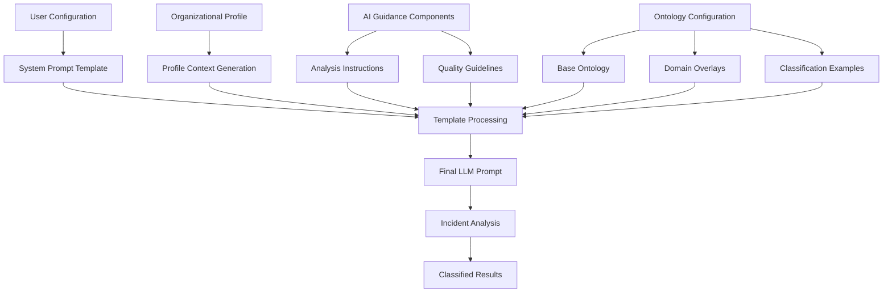

# Incident Tracking Configuration Guide

## Overview

The AuNoo AI Incident Tracking system uses a sophisticated multi-component configuration system that combines System Prompts, AI Guidance, Organizational Profiles, and Ontologies to provide context-aware threat intelligence analysis. This guide explains how these components work together and how to configure them effectively.

## Architecture Overview



## Component Breakdown

### 1. System Prompt Template

**Purpose**: The core template that defines the LLM's role and instructions

**Template Structure**:
```
You are a threat intelligence analyst tracking incidents, entities, and events in {topic}.

IMPORTANT: Assess credibility and plausibility. Treat extraordinary, self-reported breakthroughs with skepticism.
Use factual_reporting, MBFC credibility, and bias indicators. Down-rank or flag items from low/mixed credibility or fringe bias sources.

{profile_context}

{analysis_instructions}

{quality_guidelines}

{ontology_text}

Required fields for each item:
- name, type, subtype, description, article_uris, timeline, significance
- investigation_leads, related_entities, plausibility, source_quality
- misinfo_flags, credibility_summary

Output a pure JSON array only.
```

**Key Features**:
- **Role Definition**: Establishes the AI as a threat intelligence analyst
- **Credibility Framework**: Built-in skepticism for extraordinary claims
- **Template Variables**: Placeholders for dynamic content injection
- **Output Requirements**: Specifies exact JSON structure needed

### 2. AI Guidance Components

#### 2.1 Analysis Instructions

**Purpose**: Specific guidance on how the AI should analyze articles and classify incidents

**Default Content**:
```
Focus on extracting actionable intelligence from news articles. Prioritize:

1. Material business impacts and strategic changes
2. Regulatory actions and compliance issues
3. Security incidents and data breaches
4. Significant funding, M&A, or operational changes
5. Technology launches and competitive developments

Avoid over-classifying routine announcements as incidents unless they have clear material impact.
```

**How It's Used**: Injected directly into system prompt via `{analysis_instructions}` placeholder

#### 2.2 Quality Control Guidelines

**Purpose**: Standards for assessing source credibility and information quality

**Default Content**:
```
Credibility Assessment:
- High credibility: Major news outlets, verified sources, multiple independent confirmations
- Mixed credibility: Single source reporting, unverified claims, industry blogs
- Low credibility: Social media rumors, fringe sources, extraordinary claims without evidence

Extraordinary Claims Protocol:
- Flag claims that seem too good to be true or represent major breakthroughs
- Require independent verification for significant technical achievements
- Down-rank significance for self-reported successes without third-party validation
```

**How It's Used**: Injected directly into system prompt via `{quality_guidelines}` placeholder

#### 2.3 Output Format Requirements

**Purpose**: Technical specifications for LLM response structure

**Default Content**:
```
Output must be a valid JSON array with each incident object containing all required fields.
Ensure proper JSON escaping of quotes and special characters.
Do not include any explanatory text outside the JSON array.
```

**How It's Used**: Provides technical constraints for response formatting

### 3. Organizational Profile Integration

#### 3.1 Profile Data Structure

**Database Schema** (`organizational_profiles` table):
```sql
name TEXT NOT NULL,                    -- Organization name
description TEXT,                      -- Organization description  
industry TEXT,                         -- Industry sector
organization_type TEXT,                -- publisher, enterprise, startup, government
region TEXT,                          -- global, north_america, europe, asia_pacific
key_concerns TEXT,                    -- JSON array of primary concerns
strategic_priorities TEXT,            -- JSON array of strategic priorities
risk_tolerance TEXT,                  -- high, medium, low
innovation_appetite TEXT,             -- conservative, moderate, aggressive
decision_making_style TEXT,           -- data-driven, collaborative, hierarchical, agile
stakeholder_focus TEXT,              -- JSON array of key stakeholders
competitive_landscape TEXT,          -- JSON array of competitors
regulatory_environment TEXT,         -- JSON array of regulations
custom_context TEXT                  -- Additional context
```

#### 3.2 Profile Context Template

**Purpose**: Converts profile data into LLM-readable context

**Default Template**:
```
ORGANIZATIONAL CONTEXT:
Organization: {profile_name} ({organization_type} in {industry})
Region: {region}
Risk Tolerance: {risk_tolerance} | Innovation Appetite: {innovation_appetite}
Decision Making: {decision_making_style}

Key Concerns: {key_concerns}
Strategic Priorities: {strategic_priorities}
Key Stakeholders: {stakeholder_focus}
Competitive Landscape: {competitive_landscape}
Regulatory Environment: {regulatory_environment}

Custom Context: {custom_context}

ANALYSIS INSTRUCTIONS:
- Prioritize incidents and events that align with the organization's key concerns and strategic priorities
- Assess significance based on the organization's risk tolerance and decision-making style  
- Consider impact on key stakeholders and competitive positioning
- Account for relevant regulatory and compliance implications
- Tailor investigation leads to organizational context and priorities
```

#### 3.3 Real-World Example: Wiley Scientific Publisher

**Profile Data**:
```json
{
  "name": "Wiley Scientific Publisher",
  "industry": "Academic Publishing",
  "organization_type": "Publisher",
  "region": "Global",
  "key_concerns": ["Open access compliance", "AI content detection", "Publisher reputation"],
  "strategic_priorities": ["Quality control", "Academic integrity", "Competitive positioning"],
  "risk_tolerance": "Conservative",
  "innovation_appetite": "Moderate",
  "decision_making_style": "Data-driven",
  "stakeholder_focus": ["Academic authors", "Institutional subscribers", "Editorial boards"],
  "competitive_landscape": ["Elsevier", "Springer Nature", "Taylor & Francis"],
  "regulatory_environment": ["EU Copyright Directive", "GDPR", "Academic publishing standards"]
}
```

**Generated Context**:
```
ORGANIZATIONAL CONTEXT:
Organization: Wiley Scientific Publisher (Publisher in Academic Publishing)
Region: Global
Risk Tolerance: Conservative | Innovation Appetite: Moderate
Decision Making: Data-driven

Key Concerns: Open access compliance, AI content detection, Publisher reputation
Strategic Priorities: Quality control, Academic integrity, Competitive positioning
Key Stakeholders: Academic authors, Institutional subscribers, Editorial boards
Competitive Landscape: Elsevier, Springer Nature, Taylor & Francis
Regulatory Environment: EU Copyright Directive, GDPR, Academic publishing standards

ANALYSIS INSTRUCTIONS:
- Prioritize incidents affecting academic publishing and research integrity
- Assess significance based on conservative risk tolerance
- Focus on regulatory compliance and reputation management
- Consider impact on academic authors and institutional relationships
```

### 4. Ontology System

#### 4.1 Base Ontology Structure

**Core Classifications**:
```
ONTOLOGY — Types and Subtypes
Valid types: incident | event | entity

Definitions:
- incident: Discrete occurrence with material operational/strategic/risk impact that may warrant response, remediation, or escalation.
- event: Noteworthy occurrence (signals, milestones, announcements) that informs context or trends but is not itself a disruptive incident.
- entity: Organization, person, product, venue, dataset (things we track, not occurrences).

Recommended subtypes:
- incident: regulatory_action, compliance_breach, data_security, legal_ip, mna, layoffs, funding_cut, rd_spend_change, governance_change
- event: product_launch, feature_update, partnership_mou, funding_round, hiring, award, conference_announcement, roadmap_teaser, benchmark_result
- entity: company, person, product, dataset, venue, regulator

Assignment rules:
- Prefer 'incident' only when direct impact or required action is likely within the analysis window.
- Prefer 'event' for announcements and market signals absent direct disruptions or obligations.
- Always include a 'subtype' from the lists above.
```

#### 4.2 Domain-Specific Overlays

**Purpose**: Industry-specific classification rules that override or extend base ontology

**Example: Scientific Publisher Domain**:
```
Domain overlay — scientific_publisher:
- Treat as incident: legal_ip (patent disputes, licensing changes), rd_spend_change (material increases/decreases, major lab closures), regulatory_action affecting IP/open access policy, acquisition of critical editorial/data assets.
- Treat as event: competitor product_launch (new journal/platform/analytics offering), feature_update, conference_announcement, partnership_mou.

Examples:
  - 'Elsevier raises R&D spend by 25% in AI editorial tooling' → type=incident, subtype=rd_spend_change, significance=high.
  - 'Wiley launches a new open-access analytics platform' → type=event, subtype=product_launch, significance=medium.
```

#### 4.3 Classification Examples

**Purpose**: Concrete examples to train the LLM on proper classification

**Format**:
```json
{"name": "Patent infringement suit filed against AlphaBio", "type": "incident", "subtype": "legal_ip"}
{"name": "Competitor releases LLM-based summarizer", "type": "event", "subtype": "product_launch"}  
{"name": "AlphaBio", "type": "entity", "subtype": "company"}
```

## Complete Integration Example

### Input Articles:
1. **"OpenAI Announces GPT-5 with Revolutionary Capabilities"** (TechCrunch)
2. **"EU Proposes Stricter AI Regulations Following Safety Concerns"** (Reuters)
3. **"Elsevier Acquires AI Content Detection Startup for $500M"** (Publishing Weekly)

### For Wiley Scientific Publisher Profile:

**Generated Analysis**:
```json
[
  {
    "name": "EU AI Content Regulation Implementation",
    "type": "incident", 
    "subtype": "regulatory_action",
    "significance": "high",
    "description": "New EU regulations requiring AI content detection could impact academic publishing workflows and compliance costs",
    "investigation_leads": ["Open access compliance impact", "Editorial workflow changes", "Competitor compliance strategies"],
    "plausibility": "likely",
    "source_quality": "high"
  },
  {
    "name": "Elsevier AI Detection Acquisition", 
    "type": "incident",
    "subtype": "mna",
    "significance": "high", 
    "description": "Major competitor acquiring AI detection capabilities, potentially affecting competitive positioning in academic integrity tools",
    "investigation_leads": ["Competitive response options", "AI detection market analysis", "Academic integrity tool landscape"],
    "plausibility": "likely",
    "source_quality": "high"
  },
  {
    "name": "OpenAI GPT-5 Launch",
    "type": "event",
    "subtype": "product_launch", 
    "significance": "medium",
    "description": "New AI model could impact content generation and detection challenges in academic publishing",
    "investigation_leads": ["AI content detection updates needed", "Academic policy implications", "Author guidance updates"],
    "plausibility": "likely", 
    "source_quality": "high"
  }
]
```

**Key Differences from Generic Analysis**:
- ✅ **Regulatory focus**: EU regulations classified as high-significance incident
- ✅ **Competitive awareness**: Elsevier acquisition seen as strategic threat
- ✅ **Industry context**: GPT-5 analyzed for academic publishing implications
- ✅ **Conservative risk assessment**: Higher significance for regulatory/competitive threats
- ✅ **Relevant investigation leads**: Academic integrity, compliance, competitive response

## Configuration Best Practices

### 1. System Prompt Customization

**Do**:
- Use clear role definitions
- Include credibility assessment instructions
- Specify exact output requirements
- Use template placeholders for dynamic content

**Don't**:
- Make prompts too long (>4000 characters)
- Include contradictory instructions
- Forget required placeholders

### 2. AI Guidance Development

**Analysis Instructions Should**:
- Be specific to your use case
- Prioritize what matters to your organization
- Provide clear decision criteria
- Include domain expertise

**Quality Guidelines Should**:
- Define credibility standards
- Establish verification requirements
- Set significance thresholds
- Include bias detection criteria

### 3. Organizational Profile Setup

**Essential Fields**:
- **Key Concerns**: What keeps leadership awake at night
- **Strategic Priorities**: Current organizational focus areas
- **Risk Tolerance**: How conservative vs aggressive to be
- **Stakeholder Focus**: Who is impacted by decisions
- **Competitive Landscape**: Who to watch and compare against

**Profile Impact on Analysis**:
- **Conservative Risk Tolerance** → Higher significance for regulatory/compliance issues
- **Aggressive Innovation** → Focus on technology disruptions and opportunities
- **Data-Driven Decision Making** → Emphasis on quantifiable impacts and metrics

### 4. Ontology Customization

**Base Ontology**:
- Keep standard incident/entity/event structure
- Customize subtypes for your industry
- Adjust assignment rules for your context

**Domain Overlays**:
- Create industry-specific classification rules
- Override general rules with domain expertise
- Provide concrete examples for your sector

## Testing and Validation

### 1. Configuration Testing

The system includes a built-in testing framework:

**Test Process**:
1. **Sample Article Generation**: 3 realistic test scenarios
2. **Configuration Application**: All templates and profiles applied
3. **Simulated Analysis**: Expected classification results
4. **Validation Feedback**: Configuration completeness check

**Sample Test Results**:
```
✅ Test Successful! Found 3 classifications
- 1 Incident: EU regulatory action (high significance)
- 1 Event: GPT-5 announcement (high significance)  
- 1 Entity: Tesla AI division (medium significance)

Configuration Validation:
✓ System prompt: 2,847 characters
✓ Profile integration: Enabled
✓ Ontology: 1,234 characters
✓ Quality guidelines: 892 characters
```

### 2. Validation Checks

**Automatic Validation**:
- Required placeholder presence
- JSON format validation in examples
- Template structure verification
- Profile context completeness

**Manual Validation**:
- Test with sample articles
- Review classification logic
- Verify investigation leads quality
- Check organizational alignment

## Real-World Configuration Examples

### Example 1: Technology Enterprise

**Profile Configuration**:
```json
{
  "name": "TechCorp Analytics",
  "organization_type": "Enterprise",
  "industry": "Technology",
  "key_concerns": ["AI safety", "competitive intelligence", "regulatory compliance"],
  "strategic_priorities": ["Market leadership", "innovation", "risk management"],
  "risk_tolerance": "Medium",
  "innovation_appetite": "Moderate"
}
```

**Analysis Focus**: 
- Technology disruptions and competitive threats
- Regulatory changes affecting tech companies
- Market opportunities and strategic partnerships

### Example 2: Financial Services

**Profile Configuration**:
```json
{
  "name": "FinanceFirst Bank",
  "organization_type": "Financial Institution", 
  "industry": "Financial Services",
  "key_concerns": ["Regulatory compliance", "Cybersecurity", "Customer trust"],
  "strategic_priorities": ["Risk management", "Digital transformation", "Regulatory adherence"],
  "risk_tolerance": "Low",
  "innovation_appetite": "Conservative"
}
```

**Analysis Focus**:
- Financial regulations and compliance requirements
- Cybersecurity threats and data breaches
- Fintech disruptions and competitive analysis

### Example 3: Academic Publisher

**Profile Configuration**:
```json
{
  "name": "Academic Press International",
  "organization_type": "Publisher",
  "industry": "Academic Publishing", 
  "key_concerns": ["Open access compliance", "AI content detection", "Academic integrity"],
  "strategic_priorities": ["Quality control", "Editorial standards", "Author relationships"],
  "risk_tolerance": "Conservative",
  "innovation_appetite": "Moderate"
}
```

**Analysis Focus**:
- Academic integrity and AI-generated content
- Open access regulations and compliance
- Publishing industry consolidation and competition

## Advanced Configuration Techniques

### 1. Dynamic Ontology Adaptation

**Industry-Specific Subtypes**:

**Healthcare**:
```
- incident: patient_data_breach, regulatory_violation, clinical_trial_failure
- event: drug_approval, medical_device_launch, research_publication
- entity: pharmaceutical_company, medical_device_manufacturer, healthcare_provider
```

**Financial Services**:
```
- incident: data_breach, regulatory_fine, trading_system_failure
- event: product_launch, partnership_announcement, earnings_report
- entity: bank, fintech_startup, regulatory_agency
```

### 2. Risk-Based Significance Scoring

**Conservative Organizations** (Low Risk Tolerance):
- Regulatory actions → High significance
- Compliance issues → High significance
- Reputation risks → High significance
- Technology disruptions → Medium significance

**Aggressive Organizations** (High Risk Tolerance):
- Technology breakthroughs → High significance
- Market opportunities → High significance
- Competitive threats → High significance
- Regulatory actions → Medium significance

### 3. Stakeholder-Focused Investigation Leads

**For Academic Publishers**:
- Investigation leads focus on: Editorial impact, Author relationships, Institutional subscribers
- Example: "Impact on editorial review processes", "Author submission guidelines update needed"

**For Technology Companies**:
- Investigation leads focus on: Product development, Market positioning, Technical capabilities
- Example: "Competitive feature analysis", "Technology integration opportunities"

## Template Placeholder Reference

### Core Placeholders

| Placeholder | Source | Purpose |
|-------------|--------|---------|
| `{topic}` | User selection | Current analysis topic |
| `{articles_text}` | System generated | Formatted article content |
| `{ontology_text}` | Configuration | Complete ontology with overlays |
| `{profile_context}` | Profile + template | Organizational context |
| `{analysis_instructions}` | AI Guidance | How to analyze articles |
| `{quality_guidelines}` | AI Guidance | Credibility standards |

### Profile Context Placeholders

| Placeholder | Profile Field | Example |
|-------------|---------------|---------|
| `{profile_name}` | name | "Wiley Scientific Publisher" |
| `{industry}` | industry | "Academic Publishing" |
| `{organization_type}` | organization_type | "Publisher" |
| `{region}` | region | "Global" |
| `{risk_tolerance}` | risk_tolerance | "Conservative" |
| `{innovation_appetite}` | innovation_appetite | "Moderate" |
| `{decision_making_style}` | decision_making_style | "Data-driven" |
| `{key_concerns}` | key_concerns (JSON) | "Open access compliance, AI content detection" |
| `{strategic_priorities}` | strategic_priorities (JSON) | "Quality control, Academic integrity" |
| `{stakeholder_focus}` | stakeholder_focus (JSON) | "Academic authors, Institutional subscribers" |
| `{competitive_landscape}` | competitive_landscape (JSON) | "Elsevier, Springer Nature" |
| `{regulatory_environment}` | regulatory_environment (JSON) | "EU Copyright Directive, GDPR" |
| `{custom_context}` | custom_context | "Focus on research integrity and editorial standards" |

## Configuration Workflow

### 1. Initial Setup

1. **Select Base Ontology**: Start with standard incident/entity/event structure
2. **Configure Domain Overlay**: Add industry-specific rules if needed
3. **Set Up Profile Integration**: Enable and configure organizational context
4. **Define AI Guidance**: Customize analysis instructions and quality standards

### 2. Testing and Refinement

1. **Run Sample Tests**: Use built-in testing with sample articles
2. **Review Classifications**: Check if results align with expectations
3. **Adjust Configuration**: Refine prompts, ontology, or guidance as needed
4. **Validate Integration**: Ensure all components work together properly

### 3. Production Deployment

1. **Save Configuration**: Store settings for consistent analysis
2. **Monitor Results**: Review actual incident classifications
3. **Iterative Improvement**: Refine based on real-world performance
4. **Documentation**: Keep configuration rationale documented

## Troubleshooting Common Issues

### Issue: No Incidents Detected

**Possible Causes**:
- Ontology too restrictive
- Quality guidelines too strict
- Significance thresholds too high
- Analysis instructions too narrow

**Solutions**:
- Broaden incident definition in ontology
- Relax quality requirements for testing
- Lower significance thresholds
- Expand analysis focus areas

### Issue: Too Many False Positives

**Possible Causes**:
- Ontology too broad
- Quality guidelines too lenient
- Significance thresholds too low
- Insufficient organizational context

**Solutions**:
- Tighten incident definitions
- Strengthen credibility requirements
- Raise significance thresholds
- Add more specific organizational constraints

### Issue: Poor Investigation Leads

**Possible Causes**:
- Generic organizational profile
- Weak stakeholder definition
- Missing competitive context
- Insufficient domain expertise

**Solutions**:
- Enhance organizational profile detail
- Define specific stakeholder impacts
- Add competitive landscape context
- Include domain-specific investigation patterns

## Best Practices

### 1. Organizational Profile Development

**Start With**:
- Clear industry classification
- Specific key concerns (not generic)
- Realistic risk tolerance assessment
- Detailed stakeholder mapping

**Avoid**:
- Generic, one-size-fits-all profiles
- Contradictory priorities
- Overly complex concern lists
- Missing competitive context

### 2. AI Guidance Optimization

**Analysis Instructions Should**:
- Be specific to your threat model
- Include prioritization criteria
- Reference organizational priorities
- Provide clear decision frameworks

**Quality Guidelines Should**:
- Match your credibility standards
- Include source-specific rules
- Define verification requirements
- Set appropriate skepticism levels

### 3. Ontology Design

**Base Ontology**:
- Keep standard structure for consistency
- Customize subtypes for your domain
- Include clear assignment rules
- Provide concrete examples

**Domain Overlays**:
- Focus on industry-specific patterns
- Override general rules when needed
- Include sector-specific examples
- Reference organizational priorities

## Configuration Management

### 1. Version Control

**Track Changes**:
- Configuration export/import functionality
- Version history for prompt templates
- Change impact assessment
- Rollback capabilities

### 2. Team Collaboration

**Shared Configuration**:
- Organizational profile sharing
- Template standardization
- Best practice documentation
- Training and onboarding

### 3. Performance Monitoring

**Key Metrics**:
- Classification accuracy rates
- Investigation lead quality
- False positive/negative rates
- User satisfaction with results

**Continuous Improvement**:
- Regular configuration reviews
- Performance-based adjustments
- User feedback integration
- Industry trend adaptation

## Technical Implementation

### 1. Template Processing Pipeline

```javascript
// 1. Load organizational profile from database
const profile = await loadOrganizationalProfile(profileId);

// 2. Generate profile context using template
const profileContext = profileTemplate
  .replace(/{profile_name}/g, profile.name)
  .replace(/{key_concerns}/g, profile.key_concerns.join(', '))
  // ... all other replacements

// 3. Build complete ontology
const ontologyText = baseOntology + domainOverlay + examples;

// 4. Assemble final system prompt
const finalSystemPrompt = systemPromptTemplate
  .replace(/{topic}/g, currentTopic)
  .replace(/{profile_context}/g, profileContext)
  .replace(/{analysis_instructions}/g, analysisInstructions)
  .replace(/{quality_guidelines}/g, qualityGuidelines)
  .replace(/{ontology_text}/g, ontologyText);
```

### 2. Backend Integration Points

**API Endpoints**:
- `GET /api/organizational-profiles` - Profile management
- `GET /api/incident-config` - Configuration retrieval
- `POST /api/incident-config` - Configuration saving
- `POST /api/incident-config/validate` - Configuration validation
- `POST /api/incident-tracking` - Analysis execution

**Database Integration**:
- Profile data lookup and caching
- Configuration persistence
- Analysis result caching
- Performance metrics tracking

## Conclusion

The incident tracking configuration system provides a powerful, flexible framework for creating context-aware threat intelligence analysis. By properly integrating AI Guidance, Organizational Profiles, and Ontologies, organizations can achieve highly customized analysis that aligns with their specific priorities, risk tolerance, and operational context.

The key insight is that **all components work together in the actual LLM prompt** - they're not just documentation, but active instructions that directly influence how the AI analyzes and classifies incidents, entities, and events.

This integrated approach ensures that incident tracking results are not only technically accurate but also strategically relevant to the organization's specific needs and priorities.
