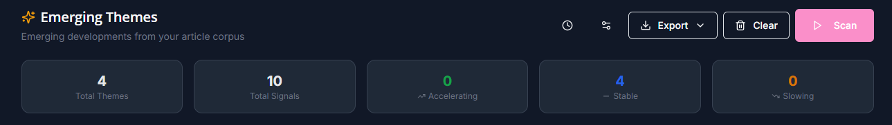

# Emerging Themes

The Emerging Themes tab provides a comprehensive view of detected emerging themes and incidents of note across your collected articles.

***

### Emerging Themes Dashboard

The Emerging Themes tab provides a comprehensive view of detected themes across your collected articles.

#### Dashboard Components

**Stats Summary (Top Row)**

Five metric cards showing:

| Metric            | Description                              |
| ----------------- | ---------------------------------------- |
| **Total Themes**  | Number of detected emerging themes       |
| **Total Signals** | Combined article count across all themes |
| **Accelerating**  | Themes with increasing coverage velocity |
| **Stable**        | Themes maintaining consistent coverage   |
| **Slowing**       | Themes with decreasing coverage velocity |

<figure><figcaption></figcaption></figure>

***

**Emerging Themes Overview**

The emerging themes overview provides quick visual queues on active categories and trends.

* **Topics Timeline (7 Days)** Full-width chart showing theme emergence and coverage over time.
* **Category Distribution** Radar chart displaying theme distribution across your configured categories.
* **Score Distribution** Histogram showing the distribution of theme relevance scores.
* **Velocity Distribution** Breakdown of themes by momentum (accelerating/stable/slowing).

<figure><figcaption></figcaption></figure>


***

#### Theme Cards

Each detected theme is displayed as an expandable card containing:

* **Theme Title** - AI-generated descriptive name
* **Velocity Indicator** - Trend direction with color coding
* **Article Count** - Number of related articles
* **Urgency Badge** - Low/Medium/High priority indicator
* **Category Badge** - Classification category
* **Detection Date** - When the theme was first identified


***

### Theme Detection Configuration

Access theme detection settings via the **gear icon** in the Emerging Themes tab header.

<figure><figcaption></figcaption></figure>

#### Configuration Options

```json
{
  "daysBack": 7,
  "model": "gpt-4.1-mini",
  "minArticles": 3,
  "maxThemes": 20,
  "categories": ["Technology", "Policy", "Market"],
  "autoDetect": true,
  "detectInterval": 24
}
```

| Setting          | Description                  | Default      | Range             |
| ---------------- | ---------------------------- | ------------ | ----------------- |
| `daysBack`       | Days of articles to analyze  | 7            | 1-30              |
| `model`          | AI model for detection       | gpt-4.1-mini | Configured models |
| `minArticles`    | Minimum articles per theme   | 3            | 1-10              |
| `maxThemes`      | Maximum themes to detect     | 20           | 5-50              |
| `autoDetect`     | Enable scheduled detection   | false        | true/false        |
| `detectInterval` | Hours between auto-detection | 24           | 1-168             |

***

#### Manual Detection

Click **"Detect Emerging Themes"** to run detection immediately with current settings.

#### Scheduled Detection

Enable **"Auto-detect"** to run theme detection on a schedule. Configure the interval based on your news volume and analysis needs.

***

### Understanding Theme Cards

#### Expanded Theme View

Clicking a theme card reveals detailed information:

**Summary Section**

* **Key Takeaway** - Primary insight from the theme
* **Description** - Detailed explanation of what the theme represents

**Events Timeline**

Visual timeline showing:

* **Trigger Event** (Red) - The initiating event or development
* **Timeline Items** (Blue) - Chronological progression of related events
* **Current Status** (Green) - Present state of the theme

**Implications**

AI-generated analysis of potential impacts and significance.

**Organization Implications**

Specific implications for your organization or use case (when configured).

**Related Articles**

List of articles that contributed to theme detection, with:

* Article title and source
* Publication date
* Relevance score
* Direct link to full article

#### Theme Actions

| Action              | Description                                        |
| ------------------- | -------------------------------------------------- |
| **Share**           | Email theme summary with organization implications |
| **Future Horizons** | Generate forward-looking scenarios                 |
| **Ask Auspex**      | Deep-dive research on the theme                    |
| **Track**           | Add to tracked themes for ongoing monitoring       |
